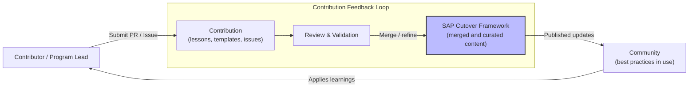

# Contributing to the SAP Cutover Framework

First off, thank you for considering contributing to this framework. 

This repository was built on the principle that **real-world experience beats theory.** By sharing your lessons learned, templates, or failure patterns, you help other Program Directors avoid the same pitfalls and elevate the standard of SAP delivery globally.

## How You Can Contribute

### 1. Share "Lessons Learned" (Anonymous or Attributed)
The most valuable part of this framework is understanding what actually happens when the plan meets reality. You can contribute by sharing:
*   **Failure Patterns:** What went wrong and why?
*   **Mitigation Strategies:** How did you recover from a critical incident during a downtime window?
*   **Regional Specificities:** Insights into specific tax, labor, or cultural nuances in different countries.

*Note: If you wish to remain anonymous to protect project confidentiality, simply state so in your Pull Request, and we will credit the contribution to "Community Contributor."*

### 2. Improve Templates & Checklists
If you have a better way to structure a RACI matrix, a more effective Go/No-Go checklist, or a new AI prompt for War Room operations, we want to see it.

### 3. Report Issues
If you find a bug in a Mermaid diagram, a broken link, or an outdated regulatory reference (e.g., changes in Brazil's Tax Reform), please open an **Issue**.

## The Contribution Process

1.  **Fork the repository** to your own GitHub account.
2.  **Create a branch** for your contribution (e.g., `git checkout -b feature/lessons-learned-emea`).
3.  **Make your changes.** Ensure you follow the existing Markdown and Mermaid formatting.
4.  **Submit a Pull Request (PR).** 
    *   Provide a clear description of what you are adding or changing.
    *   Explain the context (e.g., "Based on a recent Brownfield migration in the Manufacturing sector").
5.  **Review:** I will review your PR as soon as possible. We might discuss some points before merging it into the main branch.

## Guidelines for "Lessons Learned"
When sharing experiences, please focus on:
*   **The "Why":** Don't just say what happened; explain the root cause.
*   **The "So What":** What is the actionable advice for someone else in the same situation?
*   **Confidentiality:** Remove all specific company names, proprietary data, or sensitive project details. Focus on the *process* and the *logic*.

## Why Contribute?
By contributing, you:
*   Establish yourself as a thought leader in the SAP ecosystem.
*   Help build a "Living Playbook" that is more current and practical than any official documentation.
*   Get your name (optionally) added to our list of contributors.

---
**"Cutover is a team sport. Let's build a better playbook together."**
