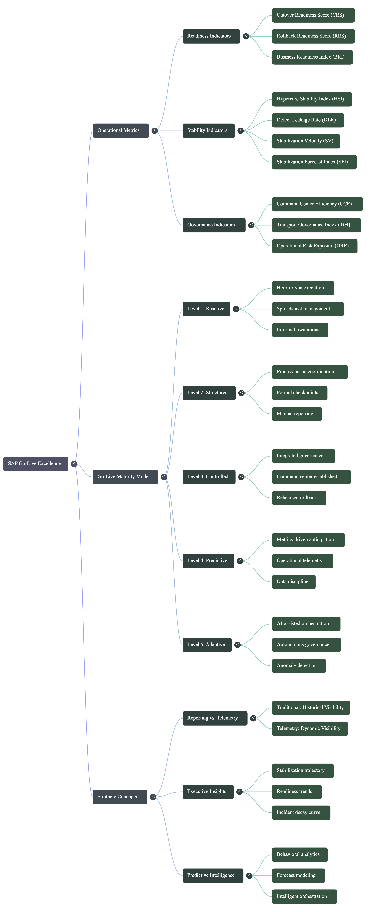

# SAP Cutover Framework

## Operational Governance, Stabilization Intelligence and Executive Telemetry for SAP Transformations

<p align="center">
  
</p>

<p align="center">
  <em>
    From Strategy to Stabilization. Execute with Control. Decide with Confidence.
  </em>
</p>

---

# Overview

The SAP Cutover Framework is an operational governance and stabilization intelligence repository designed to support SAP S/4HANA transformations, complex cutovers, hypercare execution, and post-go-live operational stabilization.

The framework combines:
- operational governance
- telemetry-driven execution
- executive visibility
- stabilization intelligence
- predictive operational metrics
- command center orchestration
- hypercare governance

to improve operational readiness, reduce go-live risks, and accelerate stabilization outcomes.

---

# Core Framework Domains

## Go-Live Operational Maturity Model

<p align="center">
  
</p>

The Go-Live Operational Maturity Model defines a structured evolution path for SAP operational governance and stabilization capabilities.

### Related Documents
- [Maturity Levels](./go-live-maturity-model/maturity-levels.md)
- [Operational Metrics](./go-live-maturity-model/operational-metrics.md)

### Maturity Levels
- Level 1 — Reactive
- Level 2 — Structured
- Level 3 — Controlled
- Level 4 — Predictive
- Level 5 — Adaptive

---

## Operational Metrics Framework

<p align="center">
  
</p>

The Operational Metrics Framework introduces telemetry-driven KPIs designed to measure operational readiness, stabilization performance, and governance effectiveness.

### Included Metrics
- Cutover Readiness Score (CRS)
- Defect Leakage Rate (DLR)
- Business Readiness Index (BRI)
- Hypercare Stability Index (HSI)
- Command Center Efficiency (CCE)
- Transport Governance Index (TGI)
- Stabilization Velocity (SV)
- Rollback Readiness Score (RRS)
- Stabilization Forecast Index (SFI)
- Operational Risk Exposure (ORE)

### Related Documents
- [Operational Metrics](./go-live-maturity-model/operational-metrics.md)

---

## Operational Governance Mind Map

<p align="center">
  
</p>

This operational mind map consolidates:
- governance domains
- telemetry relationships
- stabilization concepts
- operational intelligence structures
- hypercare orchestration components

across the SAP transformation lifecycle.

---

# Repository Navigation

## Core Governance & Frameworks

| Document | Description |
|---|---|
| [Cutover Flow](./cutover-flow.md) | End-to-end SAP cutover execution flow |
| [Hypercare Framework](./hypercare-framework.md) | Hypercare governance and stabilization model |
| [SAP War Room Model](./sap-war-room-model.md) | Operational command center governance |
| [AI for Cutover](./ai-for-cutover.md) | AI-assisted operational governance concepts |
| [Executive Summary](./executive-summary.md) | Executive-level transformation governance summary |
| [Lessons Learned](./lessons-learned.md) | Operational lessons learned framework |
| [Common Cutover Failures](./common-cutover-failures.md) | Common operational failure patterns |
| [Regulatory Go-Live Model](./regulatory-go-live-model.md) | Governance approach for regulated deployments |
| [Multi-Region Cutover Playbook](./multi-region-cutover-playbook.md) | Multi-country operational coordination model |
| [Pre-SUM Preparation](./pre-sum-preparation.md) | SAP upgrade preparation governance |
| [Cutover Checklist](./cutover-checklist.md) | Operational execution checklist |
| [Cutover Communication Templates](./cutover-communication-templates.md) | Communication governance templates |
| [Data Migration Cutover Integration](./data-migration-cutover-integration.md) | Data migration operational integration model |
| [Repository Overview](./repository-overview.md) | High-level repository structure and navigation |
| [About](./about.md) | Repository purpose and strategic vision |
| [Go-Live Maturity Model](./go-live-maturity-model/README.md) | Operational maturity framework for SAP go-live governance |
| [Contributing](./CONTRIBUTING.md) | Contribution guidelines for the framework |

---

# Repository Structure

```text
sap-cutover-framework/
│
├── go-live-maturity-model/
│   ├── images/
│   ├── maturity-levels.md
│   ├── operational-metrics.md
│
├── cutover-flow.md
├── hypercare-framework.md
├── sap-war-room-model.md
├── ai-for-cutover.md
├── lessons-learned.md
├── executive-summary.md
├── common-cutover-failures.md
├── regulatory-go-live-model.md
└── README.md
```

---

# Framework Objectives

The framework aims to support organizations in:
- improving SAP operational governance
- reducing go-live instability
- increasing deployment predictability
- accelerating stabilization cycles
- improving hypercare execution
- strengthening executive visibility
- operationalizing telemetry-based governance

---

# Strategic Vision

Future releases will expand:
- AI-assisted operational telemetry
- predictive stabilization analytics
- synthetic operational datasets
- Power BI governance dashboards
- operational intelligence models
- command center automation
- executive operational cockpits

---

# Releases

## Current Release

### v1.1 — Operational Governance & Maturity Framework

Main additions:
- Go-Live Operational Maturity Model
- Operational Metrics Framework
- Executive KPI Dashboards
- Stabilization Forecast Concepts
- Governance Visual Assets
- Repository Refactoring

### Changelog
- [CHANGELOG](./CHANGELOG.md)

---

# Author

## Nelson Biagio Jr

Senior SAP Program & Cutover Manager

Specialized in:
- SAP S/4HANA transformations
- cutover governance
- hypercare orchestration
- stabilization management
- operational governance
- executive delivery management

---

# Contributing

Contributions, suggestions, and improvements are welcome.

Please see the contribution guidelines:

- [Contributing Guide](./CONTRIBUTING.md)

---

# License

This repository is licensed under the MIT License.

- [MIT License](./LICENSE)