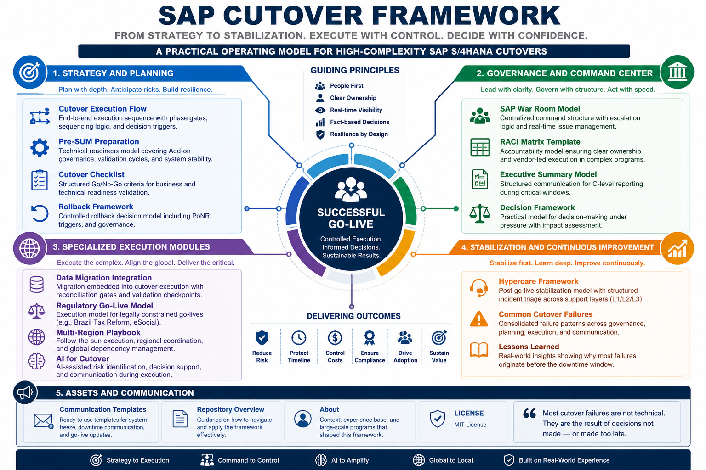

# SAP Cutover Framework

## Executive Summary

Cutover is not where projects succeed.  
It is where they fail or prove they were designed to succeed.

This repository provides a structured, execution-focused framework for SAP S/4HANA cutover, built from real-world experience in high-complexity environments.

It is not theoretical.  
It is designed for decision-making, execution control, and governance under pressure.

## SAP Cutover Framework Overview

---

## The Problem

Most SAP programs do not fail due to poor planning.

They fail because:
- Execution breaks under pressure  
- Visibility across workstreams is limited  
- Decisions are delayed or fragmented  
- Governance collapses during critical windows  

This framework addresses those failure points directly.

---

## What This Framework Delivers

A complete operating model for SAP cutover execution, covering:

- Decision-making under uncertainty  
- Structured execution control  
- Centralized governance and command  
- Multi-region coordination  
- Regulatory go-live constraints  
- AI-assisted decision support  

---

## 📌 Table of Contents

### Strategy and Planning
- **[Cutover Execution Flow](cutover-flow.md):** End-to-end execution with sequencing logic, phase gates, and decision triggers.
- **[Pre-SUM Preparation](pre-sum-preparation.md):** Technical readiness model covering Add-on governance, validation cycles, and system stability.
- **[Cutover Checklist](cutover-checklist.md):** Structured Go/No-Go criteria for business and technical readiness.
- **[Rollback Framework](cutover-rollback-framework.md):** Controlled rollback decision model including PoNR, triggers, governance, and restoration sequence.
- **[Rollback Framework](cutover-rollback-framework.md):** Controlled rollback decision model including PoNR, triggers, and governance.

---

### Governance and Command Center
- **[SAP War Room Model](sap-war-room-model.md):** Centralized command structure with escalation logic and real-time control.
- **[RACI Matrix Template](raci-cutover-template.md):** Accountability model ensuring clear ownership in complex programs.
- **[Executive Summary Model](executive-summary.md):** Structured communication for C-level reporting during critical windows.
- **[Decision Framework](cutover-decision-framework.md):** Practical model for decision-making under pressure.

---

### Specialized Execution Modules
- **[Data Migration Integration](data-migration-cutover-integration.md):** Migration embedded into cutover execution with reconciliation gates.
- **[Regulatory Go-Live Model](regulatory-go-live-model.md):** Execution under legal constraints, e.g., Brazil Tax Reform and eSocial.
- **[Multi-Region Playbook](multi-region-cutover-playbook.md):** Follow-the-sun execution and global dependency coordination.
- **[AI for Cutover](ai-for-cutover.md):** AI-assisted risk identification, decision support, and communication.

---

### Stabilization and Continuous Improvement
- **[Hypercare Framework](hypercare-framework.md):** Post go-live stabilization with structured incident triage.
- **[Common Cutover Failures](common-cutover-failures.md):** Recurring failure patterns across governance, planning, and execution.
- **[Lessons Learned](lessons-learned.md):** Real-world insights showing why failures originate before downtime.

---

### Assets and Communication
- **[Communication Templates](cutover-communication-templates.md):** Ready-to-use templates for system freeze, downtime, and go-live.
- **[Repository Overview](repository-overview.md):** Guidance on how to use the framework effectively.
- **[About](about.md):** Context and real-world programs behind the framework.
- **[LICENSE](LICENSE):** MIT License

---

## How to Use

This is not a documentation repository.  
It is an execution system.

Use it to:
- Structure cutover planning  
- Define governance and escalation models  
- Prepare Go/No-Go decisions  
- Operate War Rooms effectively  
- Manage multi-region execution  
- Support decisions under pressure  

---

## Key Principle

> Most cutover failures are not technical.  
> They are the result of decisions not made — or made too late.

---

## Positioning

This framework is built from real program experience across:

- ECC to S/4HANA migrations  
- Global upgrades  
- Regulatory-driven go-lives  
- Multi-region deployments  

It reflects what actually works when execution begins.

---

## Contribution

This repository is open for contributions focused on:

- Execution models  
- Governance improvements  
- Real-world scenarios  
- Practical templates  

Please refer to the [Contribution Guidelines](CONTRIBUTING.md) for details.

---

## License

MIT License