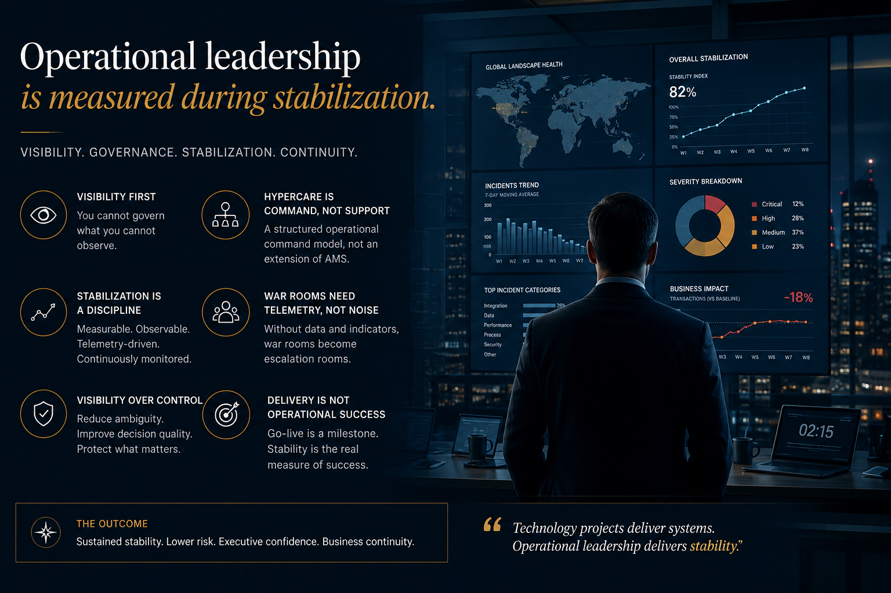
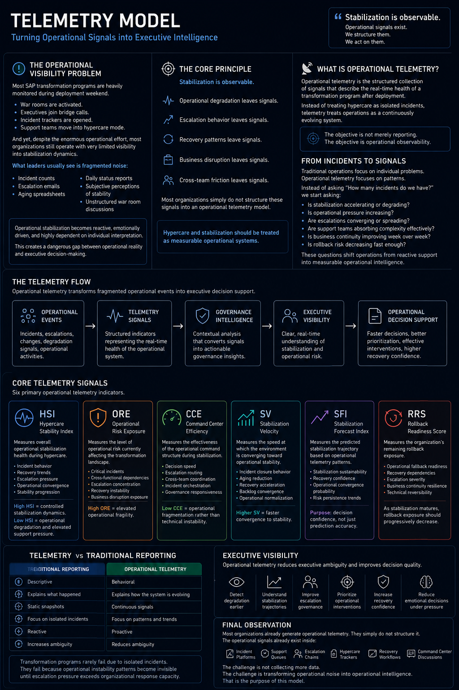

<p align="center">


</p>

# SAP Operational Intelligence

<p align="center">
  
</p>

> Turning post-deployment noise into structured operational visibility.

---

# Executive Summary

SAP Operational Intelligence is a public framework focused on operational visibility, stabilization observability, telemetry-driven governance, and hypercare intelligence for large-scale SAP transformations.

The repository combines:
- operational governance
- telemetry concepts
- stabilization intelligence
- executive visibility
- hypercare operational models
- transformation observability
- escalation governance
- operational convergence frameworks.

The goal is not only to improve deployment execution.

The goal is to improve operational understanding during the unstable periods that follow enterprise transformations.

---

# Core Principle

## Stabilization is observable.

Large-scale SAP transformations continuously generate operational signals.

Escalation behavior leaves signals.

Recovery patterns leave signals.

Operational degradation leaves signals.

Business disruption leaves signals.

Most organizations simply do not structure these signals into operational intelligence systems.

---

# Repository Evolution

<p align="center">
  
</p>

<p align="center">
  <em>
    Evolution timeline of the SAP Operational Intelligence platform, showing the strategic expansion from traditional SAP cutover governance into telemetry-driven operational intelligence, stabilization observability, executive visibility, and hypercare intelligence capabilities.
  </em>
</p>

---

# Table of Contents

- [Executive Profile](#executive-profile)
- [Go-Live Maturity Model](#go-live-maturity-model)
- [Operational Intelligence Layer](#operational-intelligence-layer)
- [Field Notes](#field-notes)
- [Repository Structure](#repository-structure)
- [Strategic Direction](#strategic-direction)
- [Why This Repository Exists](#why-this-repository-exists)
- [Target Audience](#target-audience)
- [Philosophy](#philosophy)
- [Contributing](#contributing)
- [License](#license)

---

# Executive Profile

<p align="center">
  
</p>

The Executive Profile capability consolidates leadership philosophy, operational governance principles, transformation positioning, and executive communication models.

## Key Documents

- [Leadership Philosophy](./executive-profile/leadership-philosophy.md)
- [Operational Governance](./executive-profile/operational-governance.md)
- [Selected Transformations](./executive-profile/selected-transformations.md)

---

# Go-Live Maturity Model

<p align="center">
  
</p>

The Go-Live Maturity Model introduces structured maturity levels for SAP deployment governance, stabilization readiness, and operational convergence.

## Key Documents

- [Maturity Levels](./go-live-maturity-model/maturity-levels.md)
- [Operational Metrics](./go-live-maturity-model/operational-metrics.md)

---

# Operational Intelligence Layer

<p align="center">
  
</p>

The Operational Intelligence layer introduces telemetry-driven governance concepts designed to improve stabilization observability, executive visibility, and operational decision support during SAP transformations.

This capability expands traditional cutover governance into measurable operational intelligence.

## Key Documents

- [Operational Intelligence README](./operational-intelligence/README.md)
- [Telemetry Model](./operational-intelligence/telemetry-model.md)
- [Metrics Dictionary](./operational-intelligence/metrics-dictionary.md)
- [Operational KPIs](./operational-intelligence/operational-kpis.md)

---

# Field Notes

<p align="center">
  
</p>

<p align="center">
  <em>
    Observations from SAP S/4HANA war rooms, stabilization command centers, escalation governance, and operational convergence during large-scale transformation programs.
  </em>
</p>

The Field Notes section captures operational observations gathered during real SAP transformation programs across global manufacturing, commodities trading, financial services, and regulated industries.

These are not theoretical governance models.

They are recurring operational patterns observed during:
- cutover execution
- stabilization windows
- hypercare operations
- escalation management
- executive command center governance.

The objective is to document the hidden operational dynamics that traditional project reporting structures rarely capture.

## Key Topics

- War room governance
- Escalation behavior
- Hypercare operational patterns
- Stabilization convergence
- Executive visibility gaps
- Decision velocity
- Governance failure signals
- Operational noise management

## Documents

- [Field Notes](./FIELD_NOTES.md)

---

# Repository Structure

```text
sap-operational-intelligence/
│
├── assets/
│
├── executive-profile/
│   ├── images/
│   ├── leadership-philosophy.md
│   ├── operational-governance.md
│   ├── selected-transformations.md
│   └── README.md
│
├── go-live-maturity-model/
│   ├── images/
│   ├── maturity-levels.md
│   ├── operational-metrics.md
│   └── README.md
│
├── operational-intelligence/
│   ├── datasets/
│   ├── images/
│   ├── screenshots/
│   ├── telemetry-model.md
│   ├── metrics-dictionary.md
│   ├── operational-kpis.md
│   └── README.md
│
├── FIELD_NOTES.md
├── ai-for-cutover.md
├── common-cutover-failures.md
├── cutover-checklist.md
├── cutover-communication-templates.md
├── cutover-flow.md
├── data-migration-cutover-integration.md
├── executive-summary.md
├── hypercare-framework.md
├── lessons-learned.md
├── README.md
├── CHANGELOG.md
├── CONTRIBUTING.md
└── LICENSE
```

---

# Strategic Direction

The long-term vision of this repository is to evolve SAP transformation governance beyond traditional deployment execution models.

The framework explores how telemetry, operational intelligence, stabilization observability, executive visibility, and governance systems can transform post-go-live operations into measurable operational capabilities.

Future releases will continue expanding:
- stabilization telemetry
- hypercare intelligence
- executive observability
- AI-assisted governance
- operational convergence
- recovery intelligence
- transformation resilience frameworks.

---

# Why This Repository Exists

Most transformation repositories focus exclusively on:
- deployment activities
- project governance
- technical execution
- cutover checklists.

Very few explore:
- stabilization dynamics
- escalation governance
- operational convergence
- telemetry-driven visibility
- hypercare intelligence
- executive operational awareness.

This repository attempts to bridge that gap.

---

# Target Audience

This repository was designed for:
- SAP Program Managers
- Cutover Managers
- PMO Leaders
- Transformation Executives
- Hypercare Leaders
- SAP Delivery Directors
- Governance Teams
- Operational Architects.

---

# Philosophy

Large-scale SAP transformations rarely fail because of isolated incidents.

They fail because operational instability patterns become invisible until escalation pressure exceeds organizational response capacity.

Operational intelligence changes that dynamic.

---

# Contributing

Contributions, discussions, governance ideas, and operational insights are welcome.

Please review:

- [CONTRIBUTING.md](./CONTRIBUTING.md)

before submitting pull requests or changes.

---

# License

This repository is licensed under the MIT License.

---

# Final Observation

Most organizations already generate operational telemetry.

They simply do not structure it.

The challenge is not collecting more operational data.

The challenge is transforming operational noise into operational intelligence.