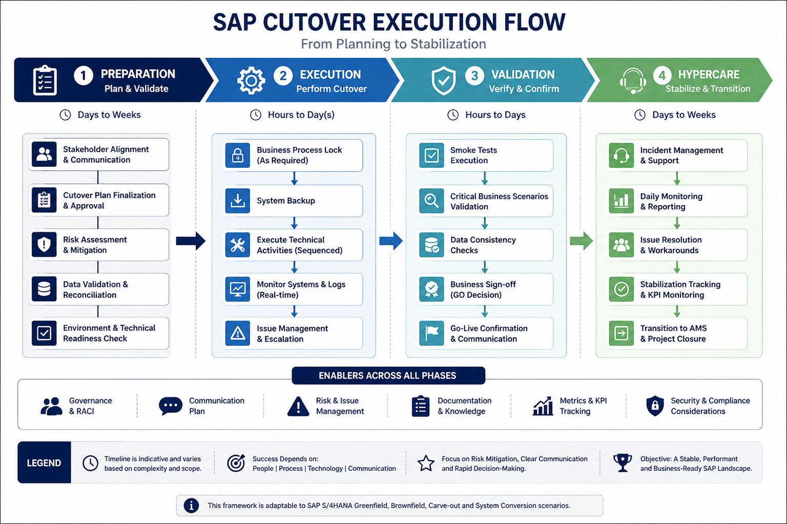

## 👤 About

[Learn more about my profile and approach](about.md)

## 📘 Repository Overview

[Understand how to use this framework](repository-overview.md)

## 🔷 Cutover Execution Flow

# SAP Cutover Framework

A framework for planning and executing cutover activities in high-criticality SAP S/4HANA programs.

Built from real war room experience, not from documentation.

---

## Context

Most cutover frameworks are written by people who read about cutovers.

This one was built by someone who ran them.

The content here reflects direct experience leading cutover and go-live operations across programs of different scales and risk profiles: a 225-person ECC-to-S/4HANA migration at CBMM (Companhia Brasileira de Metalurgia e Mineração), coordinating 11 project managers and 214 Deloitte consultants across FI, CO, MM, SD, QM, PP, PM, EWM, and TM — and a global S/4HANA upgrade at AB InBev (Project Aurora), spanning 14 countries, 8 integrated enterprise systems, and zero-tolerance conditions for operational disruption.

This framework does not prescribe a universal method. It documents what actually works under pressure, where a single unresolved dependency can cascade across regions, and where rollback decisions have to be made in real time with incomplete information.

---
## What's in this repository

### 📌 Table of Contents

#### Strategy and Planning
* **[Cutover Execution Flow](cutover-flow.md):** End-to-end execution sequence with phase gates and decision triggers.
* **[Pre-SUM Preparation](pre-sum-readiness.md):** Technical readiness framework focused on Add-on governance and stability.
* **[Cutover Checklist](cutover-checklist.md):** Go/No-Go criteria and business/technical readiness validation.

#### Governance and Command Center
* **[SAP War Room Model](sap-war-room-model.md):** Command structure, escalation logic, and real-time issue management.
* **[RACI Matrix Template](raci-cutover-template.md):** Updated accountability matrix prioritizing vendor leadership for complex programs [1],[2].
* **[Executive Summary](executive-summary.md):** Communication model for C-level reporting during cutover windows [3].

#### Specialized Execution Modules
* **[Data Migration Integration](data-migration-cutover-integration.md):** Data migration as an integrated workstream with reconciliation gates [3],[4].
* **[Regulatory Go-Live Model](regulatory-go-live-model.md):** Execution under legal deadlines like Brazil Tax Reform (IBS/CBS) and eSocial [3],[5].
* **[Multi-Region Playbook](multi-region-cutover-playbook.md):** Follow-the-sun strategy and global coordination for multinational programs [3],[6].
* **[AI for Cutover](ai-for-cutover.md):** Using AI tools to support planning and War Room operations [3].

#### Stabilization and Continuous Improvement
* **[Hypercare Framework](hypercare-framework.md):** Post go-live stabilization model with incident triage (L1/L2/L3) [3],[7].
* **[Common Cutover Failures](common-cutover-failures.md):** Observed failure patterns in governance, planning, and communication [3].
* **[Lessons Learned](lessons-learned.md):** "Battle scars" revealing why most failures originate weeks before downtime [3],[8].

#### Assets and Communication
* **[Communication Templates](cutover-communication-templates.md):** 8 ready-to-use templates for system freeze, downtime, and go-live [3].
* **[Repository Overview](repository-overview.md):** Guidelines on how to use this framework effectively [9].
* **[About](about.md):** Context and large-scale programs that shaped this content [9],[3].

---
## 📂 Downloadable Templates

| Template Name | Description | Link |
| :--- | :--- | :--- |
| **Cutover Readiness Checklist** | Essential Go/No-Go criteria, including technical and business readiness validation steps. | [Download (.csv)](assets/cutover-readiness-checklist.csv) |
| **Execution RACI Matrix** | Comprehensive matrix defining roles and responsibilities (RACI) from pre-cutover to hypercare. | [Download (.csv)](assets/cutover-raci-matrix.csv) |
| **Communication Plan Template** | Structured schedule covering the 8 essential communication templates for stakeholders and C-level. | [Download (.csv)](assets/communication-plan-template.csv) |

## Core principles behind the framework

**Cutover is not a project phase. It is a separate operation.**

It has its own command structure, its own decision cadence, and its own definition of success. Programs that treat cutover as the last sprint of the project fail at a rate that should be embarrassing — but rarely is, because the failure mode is slow and the accountability is diffuse.

**The Go/No-Go decision is not a checklist item. It is a governance moment.**

Every item on a readiness checklist can be green and the program can still fail, because the checklist captured what was visible, not what was real. Good cutover governance means knowing which risks are acceptable and which are not — before the downtime window opens.

**War room discipline is the difference between a recoverable incident and a rollback.**

Not the technology. The discipline.

---

## Scope and applicability

This framework is designed for:

- SAP ECC-to-S/4HANA migrations (Greenfield and Brownfield)
- Multi-country, multi-system go-live operations
- Programs with data migration workstreams integrated into cutover execution
- Environments where regulatory compliance (Finance, HR, Tax) is part of the go-live criteria

It is not a generic IT deployment checklist. The specificity is intentional.

---

## 🤝 Contributing

**"Cutover is a team sport. Let's build a better playbook together."**

This framework was built from real war room experiences, and it thrives on the shared knowledge of the SAP community. If you are a Program Director, Cutover Lead, or SAP Expert, your "battle scars" and insights are what keep this guide alive and relevant.

Whether you want to share an anonymous **lesson learned**, propose a **new template**, or refine an **AI prompt**, your contribution is welcome.

👉 Please read our [**Contributing Guidelines**](CONTRIBUTING.md) to see how you can help evolve this framework.

---

## Author

**Nelson Biagio Junior**
Technology Program Director | SAP S/4HANA | M&A Integration

33 years in enterprise IT. 12+ years leading SAP programs across Brazil, Latin America, the US, and Europe.

[LinkedIn](https://linkedin.com/in/nelson-biagio-junior)

---

## License

MIT — use freely, adapt to your context, attribute if you share.

## Notas Relacionadas
- [[SAP Cutover Framework]]
- [[S4HANA]]
- [[Hypercare]]
- [[ABI-S4Upgrade]]
- [[sap-cutover-framework/repository-overview]]
- [[sap-cutover-framework/executive-summary]]
- [[sap-cutover-framework/about]]
