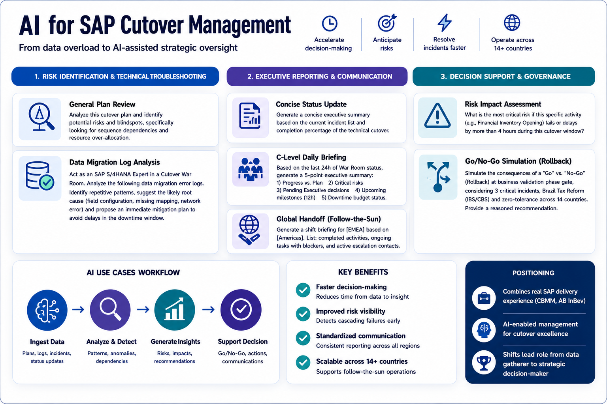

# AI for SAP Cutover Management

## 🤖 AI for SAP Cutover Management

*Figure: AI-enabled framework for SAP cutover — supporting risk identification, executive communication, and real-time decision-making during high-pressure execution windows.*

## Objective
Leverage AI to enhance decision-making, accelerate incident resolution, and improve risk anticipation during the high-pressure windows of an SAP S/4HANA cutover. The goal is to move from manual data synthesis to AI-assisted strategic oversight.

## Use Cases & Prompt Library

### 1. Risk Identification & Technical Troubleshooting
AI can be used to scan complex plans or logs to find patterns that a human eye might miss under stress.

*   **General Plan Review:**
    > "Analyze this cutover plan and identify potential risks and blindspots, specifically looking for sequence dependencies and resource over-allocation."
*   **Data Migration Log Analysis:**
    > "Act as an SAP S/4HANA Expert in a Cutover War Room. Analyze the following data migration error logs (e.g., via Migration Cockpit or SLT). Identify repetitive patterns, suggest the likely root cause (e.g., field configuration, missing mapping, or error de rede), and propose an immediate mitigation plan to avoid delays in the downtime window."

### 2. Executive Reporting & Communication
Maintaining a clear flow of information is the difference between a controlled operation and a chaotic one.

*   **Concise Status Update:**
    > "Generate a concise executive summary based on the current incident list and completion percentage of the technical cutover."
*   **C-Level Daily Briefing:**
    > "Based on the last 24 hours of War Room status (attach status logs), generate a 5-point executive summary. Focus on: 1. Progress vs. Plan; 2. Critical risks; 3. Pending Executive decisions; 4. Upcoming milestones (12h); 5. Downtime budget status."
*   **Global Handoff (Follow-the-Sun):**
    > "We are operating in a Follow-the-Sun model. Generate a shift handoff briefing for the [EMEA] team based on the activities performed by the [Americas] region. List: completed activities, ongoing tasks with blockers, and active escalation contacts."

### 3. Decision Support & Governance
AI helps simulate the impact of decisions when time is the most scarce resource.

*   **Risk Impact Assessment:**
    > "What is the most critical risk if this specific activity (e.g., Financial Inventory Opening) fails or delays by more than 4 hours during this cutover window?"
*   **Go/No-Go Simulation (Rollback):**
    > "The project has reached the business validation phase gate, but we have 3 critical incidents open. Act as a Risk Manager and simulate the consequences of a 'Go' vs. a 'No-Go' (Rollback). Consider the impact on Brazil Tax Reform (IBS/CBS) and zero-tolerance conditions for operational disruption in 14 countries. Provide a reasoned recommendation."

## Benefits
- **Faster decision-making:** Reduces the time spent synthesizing raw data into actionable insights [1].
- **Improved risk visibility:** Identifies cascading failures before they impact the critical path [2].
- **Better communication quality:** Standardizes reporting across different regions and levels of the organization [1].

## Positioning
This framework combines **traditional SAP delivery expertise** — built from real-world programs like CBMM and AB InBev — with **AI-enabled management**, shifting the cutover lead's role from data gatherer to strategic decision-maker [2, 3].

## Notas Relacionadas
- [[IA]]
- [[S4HANA]]
- [[ABI-S4Upgrade]]
- [[Hypercare]]
- [[SAP Cutover Framework]]
- [[sap-cutover-framework/cutover-flow]]
- [[sap-cutover-framework/sap-war-room-model]]
