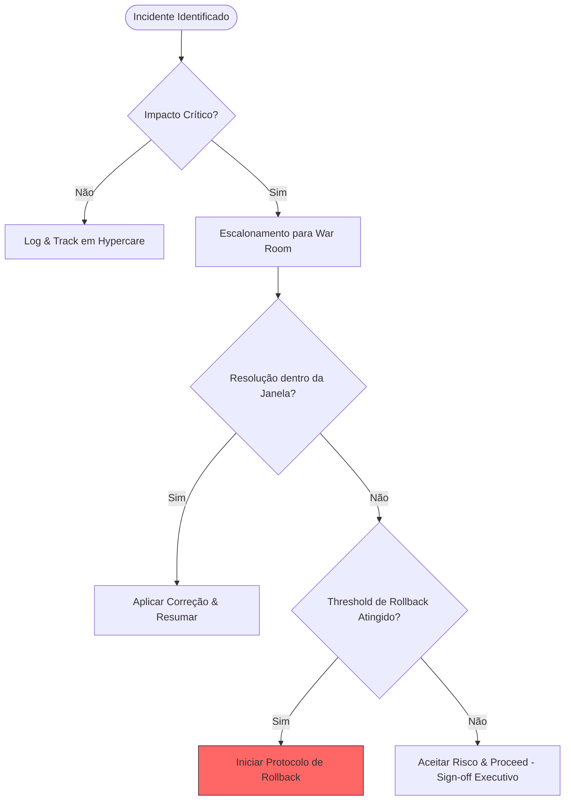

# SAP Cutover Checklist (Enterprise)

## Decision Flow During Cutover

## 1. Governance & Readiness

- Final Go/No-Go criteria defined and approved
- Steering Committee alignment completed
- Cutover plan version frozen and baselined
- Roles and responsibilities confirmed (RACI)
- War room structure validated

## 2. Technical Readiness

- All transports released and validated in production queue
- No pending critical OSS notes or inconsistencies
- Background jobs reviewed and scheduled accordingly
- Interfaces and integrations tested (end-to-end)
- Data migration reconciliation completed

## 3. Business Readiness

- Business sign-off for critical processes (OTC, PTP, RTR)
- Key users trained and available during go-live
- Manual fallback procedures defined
- Regulatory and compliance validations completed

## 4. Cutover Execution

### Phase 1 – System Preparation
- Lock business transactions (as required)
- System backup completed
- Freeze enforcement validated

### Phase 2 – Execution
- Execution of technical activities (sequenced and timed)
- Continuous monitoring of logs and system health
- Issue tracking via centralized tool (Jira / Azure DevOps / ServiceNow)

### Phase 3 – Validation
- Smoke tests executed
- Critical business scenarios validated
- Data consistency checks performed

## 5. Hypercare Preparation

- Incident management process activated
- SLA definitions aligned
- Support teams allocated (L1, L2, L3)
- Daily status cadence defined

## 6. Risk Management

| Risk | Impact | Mitigation |
|------|--------|-----------|
| Transport inconsistencies | High | Pre-cutover validation |
| Integration failures | High | Parallel testing |
| Data inconsistency | Critical | Reconciliation checkpoints |

## 7. Contingency Planning

- Rollback strategy documented and approved
- Parallel processing enabled where possible
- Manual workaround procedures available
- Decision escalation matrix defined