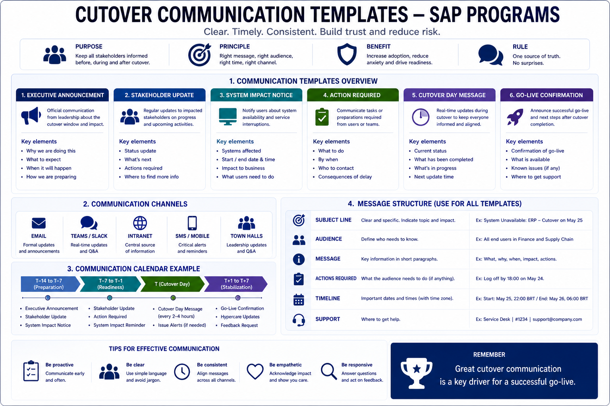

# Cutover Communication Templates

## 📢 Cutover Communication Templates



*Figure: Standard communication templates and structure for SAP cutover execution — ensuring clarity, alignment, and control across stakeholders.*

Communication during a cutover window fails in one of two ways: too much information delivered in the wrong format, or too little information delivered too late.

Both failures have the same root cause — communication was not planned. Messages were drafted under pressure, in inconsistent formats, by whoever was available at the time. The result is a stakeholder landscape that is either overwhelmed with noise or operating on outdated information.

These templates are designed to be drafted, reviewed, and approved before the downtime window opens. During execution, the only variable is the timestamp and any real-time status detail. The structure, tone, and distribution list are fixed in advance.

---

## Template 1 — System Freeze Notification

**When**: sent when the production system enters freeze mode, typically 24–48 hours before the downtime window.
**Audience**: all business users, IT operations, regional business leads.
**Channel**: email + internal communication platform (Teams, Slack).

---

**Subject**: [PROGRAM NAME] — Production System Freeze Effective [DATE/TIME UTC]

As part of [Program Name], the SAP production environment will enter system freeze effective **[DATE] at [TIME] [TIMEZONE]**.

**What this means:**
- No new change requests, transports, or configuration changes will be accepted in production after this time
- Ongoing business transactions should be completed or formally deferred before the freeze window
- Emergency change requests after this point require explicit approval from [CUTOVER LEAD NAME]

**What is not affected:**
- Normal business transaction processing continues until the downtime window begins on [DATE] at [TIME]
- Support for operational issues remains available through normal channels

**Next communication**: downtime window notification on [DATE] at [TIME].

Questions: [CONTACT NAME] — [EMAIL]

---

## Template 2 — Downtime Window Notification

**When**: sent 2–4 hours before the downtime window opens, and again at the moment the window opens.
**Audience**: all business users, regional business leads, IT operations.
**Channel**: email + internal platform + regional communication channels.

---

**Subject**: [PROGRAM NAME] — System Downtime Beginning [TIME UTC] | Expected Duration: [X] Hours

**[PROGRAM NAME] — Downtime Window Opening**

The scheduled system downtime for [Program Name] will begin at **[TIME] [TIMEZONE]** today, [DATE].

| | |
|:---|:---|
| **Downtime start** | [DATE] [TIME] [TIMEZONE] |
| **Expected duration** | [X] hours |
| **Expected system availability** | [DATE] [TIME] [TIMEZONE] (subject to confirmation) |
| **Systems affected** | [LIST: SAP ERP / Integrated systems / Portals] |
| **Regions affected** | [LIST] |

**During the downtime window:**
- SAP and connected systems will be unavailable for transaction processing
- Manual backup procedures are in effect — contact your local business coordinator for guidance
- Emergency operational issues: [EMERGENCY CONTACT NAME] — [PHONE/EMAIL]

**Go-live confirmation** will be communicated as soon as system availability is confirmed. Do not attempt to log into the system until the go-live confirmation is received.

Status updates will be published every [2 hours] at: [STATUS PAGE URL / CHANNEL]

---

## Template 3 — War Room Status Update (Internal)

**When**: every 30 minutes during the downtime window, from each regional lead to the global war room.
**Audience**: global war room participants only.
**Channel**: dedicated war room channel.
**Format**: fixed — no narrative, no context, facts only.

---

```
[TIME UTC] | [REGION/WORKSTREAM] | [LEAD NAME]

STATUS: [On track / Delayed +Xmin / Blocked]

COMPLETED:
- [Last activity completed — TIME UTC]

IN PROGRESS:
- [Current activity] — ETA [TIME UTC]
- [Parallel activity if applicable] — ETA [TIME UTC]

BLOCKERS:
- [None]
- [Description — Owner — ETA for resolution]

OPEN INCIDENTS:
- Critical: [count] | High: [count] | Medium: [count]

NEXT CHECKPOINT: [TIME UTC]
```

**Example:**

```
14:30 UTC | EUROPE BASIS | J. Silva

STATUS: Delayed +45min

COMPLETED:
- Transport import batch 1 — 13:15 UTC
- Transport import batch 2 — 14:20 UTC

IN PROGRESS:
- Transport import batch 3 — ETA 15:30 UTC (original ETA was 14:45 UTC)

BLOCKERS:
- Transport TR-EU-0047 locked by background job — Basis investigating — ETA resolution 15:00 UTC

OPEN INCIDENTS:
- Critical: 0 | High: 1 | Medium: 2

NEXT CHECKPOINT: 15:00 UTC
```

---

## Template 4 — Executive Status Update (SteerCo)

**When**: every 2 hours during the downtime window, and at go-live declaration.
**Audience**: SteerCo, executive sponsors, program leadership.
**Channel**: email or dedicated executive channel — separate from war room.
**Owner**: Global Cutover Lead. Prepared from the incident log, not from memory.

---

**Subject**: [PROGRAM NAME] — Cutover Status Update | [TIME UTC] | [STATUS: ON TRACK / AT RISK / DELAYED]

**[PROGRAM NAME] — Executive Cutover Update**
*[DATE] — [TIME UTC]*

---

**Overall Status**: 🟢 On Track / 🟡 At Risk / 🔴 Delayed

**Current phase**: [Phase name — e.g., Transport Import / Data Migration / Smoke Testing]

**Progress against plan**:
- Completed activities: [X] of [Y] ([%])
- Current activity: [Description] — ETA [TIME UTC]
- Buffer remaining: [X] hours against [Y] hour total buffer

---

**Active incidents**:

| Severity | Description | Owner | Status | ETA Resolution |
|:---|:---|:---|:---|:---|
| High | [Brief description] | [Name] | In progress | [TIME UTC] |
| Medium | [Brief description] | [Name] | In progress | [TIME UTC] |

**Resolved in last 2 hours**: [Count] — [Brief summary or "None"]

---

**Go-live outlook**: [On track for [TIME UTC] / At risk — monitoring / Revised estimate [TIME UTC]]

**Decisions required from SteerCo**: [None / Description of decision needed]

**Next update**: [TIME UTC]

*Contact: [CUTOVER LEAD NAME] — [PHONE]*

---

## Template 5 — Regional Go-Live Confirmation (Internal)

**When**: when a region completes all readiness criteria and is ready to contribute to global go-live declaration.
**Audience**: Global Cutover Lead, Global War Room.
**Channel**: global war room channel.
**Owner**: Regional Execution Lead.

---

```
[TIME UTC] | REGIONAL GO-LIVE READINESS — [REGION NAME]

Regional Lead: [NAME]

READINESS CHECKLIST:
✅ Basis sign-off — [NAME] — [TIME UTC]
✅ Data migration reconciliation — [NAME] — [TIME UTC]
✅ Functional smoke tests complete — [NAME] — [TIME UTC]
✅ Business validation sign-off — [NAME] — [TIME UTC]

OPEN ITEMS (non-blocking):
- [Description — Owner — Expected resolution]
- None

REGIONAL STATUS: READY FOR GO-LIVE

Awaiting Global Cutover Lead confirmation to proceed.
```

---

## Template 6 — Go-Live Declaration

**When**: when all regions and global gates are confirmed — this is the single most important communication of the program.
**Audience**: all stakeholders — business users, IT, executives, regional leads.
**Channel**: email + internal platform + regional channels simultaneously.
**Owner**: Global Cutover Lead.

---

**Subject**: [PROGRAM NAME] — GO-LIVE CONFIRMED | [DATE] [TIME UTC]

**[PROGRAM NAME] is now live.**

As of **[TIME] [TIMEZONE]** on [DATE], [Program Name] has successfully completed the go-live transition. SAP and all connected systems are operational.

**Regions live**: [LIST ALL REGIONS]
**Systems operational**: [LIST]
**Go-live confirmed by**: [CUTOVER LEAD NAME]

---

**Returning to normal operations:**

Business users may log into SAP and resume normal transaction processing effective immediately.

If you encounter any issues, contact the hypercare support team through the channels below — do not attempt workarounds independently.

---

**Hypercare support is now active:**

| Support level | Contact | Hours |
|:---|:---|:---|
| Business process issues | [CONTACT / CHANNEL] | [HOURS] |
| Technical / system issues | [CONTACT / CHANNEL] | 24/7 |
| Escalation | [CUTOVER LEAD / HYPERCARE LEAD] | 24/7 |

The hypercare team will be actively monitoring system stability and supporting business operations through [END DATE OF HYPERCARE PERIOD].

**Next update**: hypercare status report on [DATE] at [TIME].

Thank you to everyone who contributed to this program.

[CUTOVER LEAD NAME]
[TITLE] — [PROGRAM NAME]

---

## Template 7 — Rollback Notification

**When**: if the decision is made to roll back during the downtime window.
**Audience**: all stakeholders.
**Channel**: email + internal platform + regional channels.
**Owner**: Global Cutover Lead.
**Note**: draft this template before the window opens. Using it means the decision has already been made — communication should be fast, clear, and calm.

---

**Subject**: [PROGRAM NAME] — Go-Live Postponed | Systems Returning to Previous State

**[PROGRAM NAME] — Go-Live Postponed**

During the cutover execution window, the program team encountered [brief, factual description of the issue — e.g., "a critical data reconciliation issue that could not be resolved within the available window"].

After evaluation, the decision was made to return systems to their previous state and postpone the go-live to ensure a stable and complete transition.

**Current system status**: SAP and all connected systems are returning to pre-cutover state. Full operational availability is expected by **[TIME] [TIMEZONE]**.

**Business operations**: normal transaction processing will resume once system availability is confirmed. A separate notification will be sent when systems are ready.

**What happens next**: the program team will conduct a root cause analysis, address the identified issue, and confirm a revised go-live date. An update will be communicated within [24/48] hours.

We understand this is not the outcome we planned for. The decision to postpone was made to protect the integrity of your data and the reliability of your operations.

Questions: [CUTOVER LEAD NAME] — [EMAIL/PHONE]

---

## Template 8 — Hypercare Activation Notice

**When**: sent immediately after go-live declaration, activating the hypercare support model.
**Audience**: business leads, IT support teams, regional coordinators.
**Channel**: email + internal platform.

---

**Subject**: [PROGRAM NAME] — Hypercare Support Model Now Active

**[PROGRAM NAME] — Hypercare Period: [START DATE] to [END DATE]**

With go-live confirmed, the hypercare support model is now active. This period is designed to provide enhanced support as business operations stabilize under the new system.

**Support model:**

| Priority | Definition | Response time | Contact |
|:---|:---|:---|:---|
| P1 — Critical | System down or major business process blocked | 15 minutes | [CONTACT] |
| P2 — High | Significant impact, workaround available | 1 hour | [CONTACT] |
| P3 — Medium | Limited impact, workaround available | 4 hours | [CONTACT] |
| P4 — Low | Cosmetic or minor issue | Next business day | [CONTACT] |

**How to report an issue:**
1. [PRIMARY CHANNEL — e.g., ServiceNow queue / dedicated Teams channel]
2. Include: description, affected process, business impact, screenshot if applicable
3. Do not contact the implementation team directly — all issues through the support channel

**Daily status report**: the hypercare team will publish a daily status update at [TIME] covering open incidents, resolved issues, and system stability indicators.

**Hypercare Lead**: [NAME] — [EMAIL/PHONE]

---

## Usage notes

**Before the window opens:**
- Fill in all bracketed fields for your program
- Review with the communications owner and Cutover Lead
- Get SteerCo approval for executive templates (Templates 4 and 6)
- Confirm distribution lists for each template
- Store approved templates in a shared location accessible during the war room

**During execution:**
- Templates 3 and 4 are live documents — update status fields at each cadence
- Templates 5 and 6 are released on confirmation, not on schedule
- Template 7 should never need to be used — but it should always be ready

**After go-live:**
- Template 8 triggers the formal transition from war room to hypercare
- Archive all sent communications in the program record
