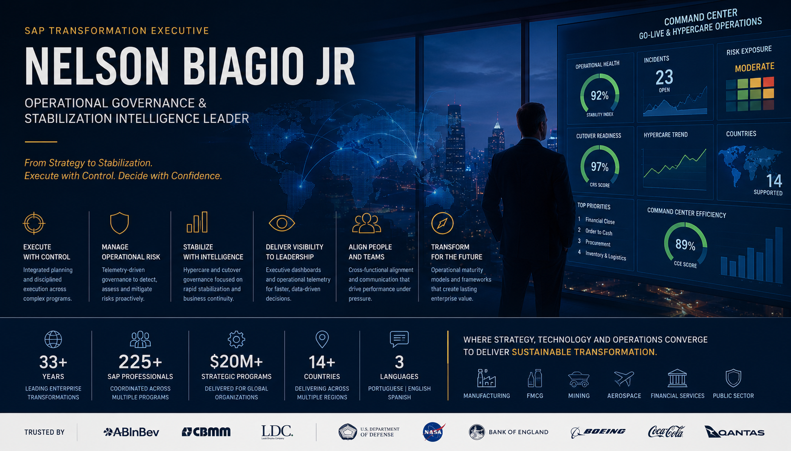

# Executive Profile

## Nelson Biagio Jr

### SAP Transformation Executive | Operational Governance & Stabilization Intelligence Leader

  

  <em>
    From Strategy to Stabilization. Execute with Control. Decide with Confidence.
  </em>

---

# Executive Overview

Technology executive with more than 33 years leading enterprise transformation programs across Brazil, Latin America, the United States, and Europe.

Career built at the intersection of:
- SAP transformation leadership
- operational governance
- enterprise PMO
- M&A integration
- regulatory modernization
- executive stabilization management

Specialized in:
- SAP S/4HANA transformations
- cutover governance
- hypercare orchestration
- operational telemetry
- stabilization intelligence
- executive command center leadership

Experience includes strategic programs, among others, for:
- AB InBev
- CBMM
- ABB
- Louis Dreyfus Company (LDC)
- Pentagon (U.S. Department of Defense)
- NASA
- Bank of England
- Bank of Canada
- Boeing
- Coca-Cola
- Qantas Airlines

---

# Executive Narrative

Most SAP programs do not fail during deployment.

They fail during stabilization.

Not because the technology does not work.

But because operational governance collapses under pressure.

Traditional project governance was designed to manage:
- scope
- milestones
- timelines
- delivery execution

Modern SAP transformations require something different.

They require:
- operational intelligence
- telemetry-driven governance
- stabilization visibility
- predictive operational control
- executive-grade operational orchestration

That operational philosophy became the foundation of the SAP Cutover Framework and the operational governance models developed throughout this repository.

---

# Core Expertise

| Domain | Expertise |
|---|---|
| SAP S/4HANA | Greenfield, Brownfield & Upgrade Programs |
| Cutover Leadership | Multi-country Go-Live Governance |
| Hypercare Operations | Stabilization & Transition Management |
| Operational Governance | Executive Telemetry & KPI Frameworks |
| Data Migration | Strategy, Validation & Cutover Integration |
| M&A Technology Integration | Day 1 Readiness & TSA Governance |
| Enterprise PMO | Governance & Transformation Execution |
| Executive Delivery | SteerCo, Risk Escalation & Decision Support |

---

# Signature Capabilities

## Operational Stabilization Leadership

Designed and led governance structures for high-risk SAP transformations operating under compressed timelines and zero-downtime constraints.

---

## Hypercare Governance & Command Center Orchestration

Experience leading:
- hypercare war rooms
- operational command centers
- integrated escalation governance
- executive stabilization management
- cross-functional operational coordination

---

## Executive Operational Telemetry

Creator of telemetry-oriented operational governance concepts including:
- Cutover Readiness Score (CRS)
- Hypercare Stability Index (HSI)
- Operational Risk Exposure (ORE)
- Stabilization Forecast Index (SFI)
- Command Center Efficiency (CCE)

---

# Repository Navigation

| Document | Description |
|---|---|
| [Executive Profile](./executive-profile.md) | Full executive leadership profile |
| [Leadership Philosophy](./leadership-philosophy.md) | Operational leadership principles |
| [Operational Governance Vision](./operational-governance-vision.md) | Future vision for SAP operational governance |
| [Selected Transformations](./selected-transformations.md) | Major SAP transformation programs |
| [Transformation Case Studies](./transformation-case-studies.md) | Executive operational case studies |
| [Speaking Topics](./speaking-topics.md) | Advisory and speaking areas |
| [Resume PDF](./nelson-biagiojr-resume.pdf) | Download executive resume |

---

# Frameworks & Intellectual Property

| Framework | Description |
|---|---|
| [SAP Cutover Framework](../README.md) | Executive operational governance framework |
| [Go-Live Maturity Model](../go-live-maturity-model/maturity-levels.md) | Operational maturity evolution framework |
| [Operational Metrics Framework](../go-live-maturity-model/operational-metrics.md) | Telemetry-driven governance KPIs |
| [SAP War Room Model](../sap-war-room-model.md) | Command center governance model |
| [Hypercare Framework](../hypercare-framework.md) | Stabilization and post-go-live governance |

---

# Leadership Philosophy

> Go-live is not the end of the project.
> It is the beginning of operational reality.

Operational stabilization should become:
- measurable
- governable
- telemetry-driven
- predictive
- executive-visible

The future of SAP delivery will increasingly depend on:
- operational telemetry
- AI-assisted governance
- predictive stabilization
- command center intelligence
- integrated operational risk visibility

---

# Speaking & Advisory Topics

- SAP S/4HANA Operational Governance
- Hypercare Intelligence & Stabilization
- Executive Telemetry for SAP Programs
- Predictive Stabilization Models
- Operational Risk Exposure
- Command Center Governance
- SAP Cutover Intelligence
- Transformation Leadership under Pressure

---

# Contact

- LinkedIn: https://linkedin.com/in/nelson-biagio-junior
- GitHub: https://github.com/nelson-biagiojr
- Email: nbiagiojunior@gmail.com

---

# Languages

- Portuguese — Native
- English — Fluent / Bilingual
- Spanish — Fluent / Bilingual
- Italian — Basic

---

# Certifications

- SAP Activate Methodology
- ERP SAP Expert (with ABAP knowledge)
- Microsoft MCSE 2000 & 2003
- Data Science 3.0
- PMP

---

# Resume

- [Download Executive Resume PDF](./nelson-biagiojr-resume.pdf)