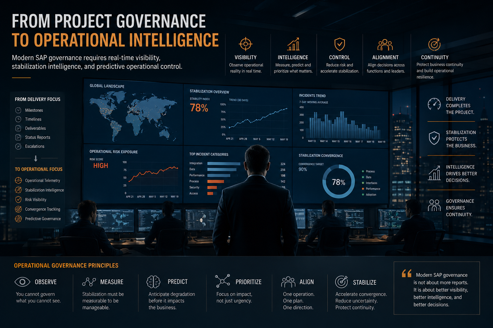

# Operational Governance Vision

  

  <em>
    SAP governance is evolving from project management into operational intelligence.
  </em>

## Beyond Traditional SAP Program Management

---

# Traditional SAP Governance Is Reaching Its Limits

Most SAP governance models were designed for a world that no longer exists.

A world where deployments took years, landscapes were relatively self-contained, integrations were manageable in a spreadsheet, and the business could tolerate two or three days of downtime during a migration window without catastrophic consequences.

That world is gone.

Modern SAP transformations operate inside highly integrated enterprise ecosystems with real-time operational dependencies, global supply chains, regulatory-sensitive processes, and near-zero tolerance for downtime. Delivery cycles are compressed. Stakeholder expectations are higher. The cost of operational failure after go-live is significantly larger than it was a decade ago.

And yet many organizations still govern these programs using models built primarily around status reporting, milestone tracking, delivery coordination, and escalation management.

The operational complexity evolved faster than the governance model. That gap is now visible in programs that deliver on time and then spend months fighting to stabilize.

---

# Delivery Governance Is No Longer Enough

Most PMOs are optimized around one question: is the project progressing?

That is a necessary question. It is not a sufficient one.

Because a program can answer "yes" to every delivery metric and still produce an operationally fragile outcome. Milestones green. Timelines protected. Cutover completed. Defect count declining. And the operation itself unstable, dependent on manual intervention, accumulating operational debt at a pace the organization has not yet measured.

Traditional delivery metrics do not expose operational fragility. They were not designed to. They were designed to track execution against a plan, not to assess whether the business is actually recovering from the disruption a large SAP deployment inevitably creates.

What governance cannot observe, governance cannot manage.

That is not a philosophy. That is an operational constraint.

---

# The Missing Layer: Operational Intelligence

There is a layer missing in most SAP program governance structures.

Not another dashboard. Not another weekly status call. Not a more granular RAG report.

An operational intelligence layer: real-time visibility into stabilization progress, measurable telemetry on system and process behavior, integrated risk exposure across workstreams, convergence indicators that show whether the operation is actually improving or merely quiet at the moment, and executive-level intelligence that reflects operational reality rather than curated perception.

Without that layer, the consequences are structural. Hypercare becomes reactive because there is no proactive signal to act on. War rooms become chaotic because decisions are made on incomplete information under emotional pressure. Escalation management becomes loud and inefficient because everything competes for attention with equal urgency. Executive decisions lose operational grounding because the data reaching leadership is too slow, too aggregated, or too optimistic.

The goal is not more information. The goal is better decisions, faster, with less uncertainty.

---

# Telemetry-Driven Governance

Operational telemetry is not a new concept. In IT infrastructure, in manufacturing, in logistics, the idea that you instrument your systems and measure what is actually happening is foundational.

In SAP program governance, it is still treated as advanced.

That needs to change.

Governing a large SAP program post go-live without telemetry is operationally equivalent to flying without instruments. You can still fly. You are also significantly more likely to discover problems at the worst possible moment.

Telemetry-driven governance changes the nature of leadership. Instead of reacting to what escalates, leadership can observe what is actually degrading. Instead of relying on fragmented incident reports filtered through multiple layers of interpretation, leadership can see operational trends directly. Instead of governing based on anecdotal feedback from exhausted teams, governance becomes observable, measurable, and dynamically connected to operational reality.

The organizations that develop this capability earlier will operate transformations with substantially lower risk. Not because they are more disciplined in general, but because they applied instrumentation where it matters most.

---

# Stabilization Is Becoming an Intelligence Discipline

Most organizations still treat post go-live stabilization as a temporary phase. Something that happens between the cutover and the handover to AMS. A cleanup effort. An extension of hypercare until things feel stable enough to move on.

That framing is increasingly inadequate for the complexity of modern SAP programs.

Stabilization is becoming an intelligence discipline. One that requires convergence analysis, operational trend detection, escalation pattern recognition, predictive incident forecasting, and operational risk scoring. Not as aspirational future-state capabilities, but as practical governance requirements for programs that operate across multiple countries, multiple business units, and deeply integrated landscapes.

The organizations capable of measuring stabilization properly gain concrete, practical advantages: shorter hypercare durations, lower operational fatigue across teams, faster recovery of business confidence, and earlier achievement of operational maturity. The organizations that cannot measure stabilization remain in extended uncertainty, managing by perception rather than evidence.

The measurement tools exist. What is missing, in most cases, is the governance design that makes them part of the program from the beginning rather than an afterthought requested when things go wrong.

---

# Why Most War Rooms Become Reactive

War rooms do not fail because of incompetence. That is important to say clearly, because the instinct when a war room deteriorates is to look for the individual responsible.

War rooms fail because of architecture.

Most war rooms were designed around issue discussion and escalation coordination. Teams meet, review open incidents, assign actions, and reconvene the next day. That structure is not wrong for managing a handful of critical issues in the first 48 hours after go-live.

It becomes a liability when sustained across weeks of complex stabilization. Without telemetry, there is no shared view of whether the operation is improving or not. Without stabilization indicators, prioritization is based on whoever escalates loudest. Without convergence metrics, nobody can answer the most important executive question: are we getting better?

As pressure increases and fatigue accumulates, the room fills with noise. Teams optimize locally, protecting their own workstream rather than the overall operation. Priorities conflict without resolution. Decision quality degrades. The war room becomes an expensive meeting that produces less clarity than it consumes energy.

The discipline has to be designed before the pressure arrives. Under pressure, you execute whatever structure already exists.

---

# The Future Operational Model

The next generation of SAP governance will look materially different from what most organizations operate today.

Operational telemetry embedded in program governance from day one, not retrofitted after stabilization fails. AI-assisted governance capable of detecting patterns across incident data, change volumes, and operational indicators faster than any manual review process. Integrated command centers that function as intelligence hubs rather than escalation coordination meetings. Executive operational intelligence that reflects real-time program health rather than a weekly snapshot filtered through multiple layers of editorial judgment.

The PMO of the next decade will operate less like a reporting office and more like an operational control tower. The shift is not cosmetic. It reflects a genuine change in where the complexity of large SAP programs actually lives.

It lives in operations. Not in delivery.

---

# Governance as an Operational Discipline

The organizations that execute SAP transformations most effectively over the next decade will not necessarily be the ones with the largest PMOs, the most governance layers, or the most comprehensive status reporting structures.

They will be the organizations capable of observing operations earlier, detecting degradation before it becomes a crisis, stabilizing systems faster, reducing ambiguity at the decision-making level, and improving the quality of leadership response under pressure.

Operational governance is not bureaucracy. Bureaucracy generates process for its own sake. Operational governance reduces uncertainty so that decisions are made with better information, at the right moment, by the right people.

Those are different things. Organizations that confuse them build more process when they should be building more visibility.

---

# Final Perspective

The future of SAP governance is not a delivery methodology.

Agile, hybrid, waterfall, scaled agile: these are frameworks for managing execution. They answer the question of how work gets done. They do not answer the question of whether the operation is actually stabilizing after the work is delivered.

The future of SAP governance is operational intelligence.

Because modern enterprise transformations are no longer constrained primarily by delivery complexity. Most organizations have learned how to plan and execute large programs with reasonable predictability.

The constraint that remains is operational: what happens in the weeks and months after go-live, when the program structure starts to wind down and the business is expected to absorb a fundamentally changed operational reality.

That constraint will not be solved by better project management.

It will be solved by better operational governance.