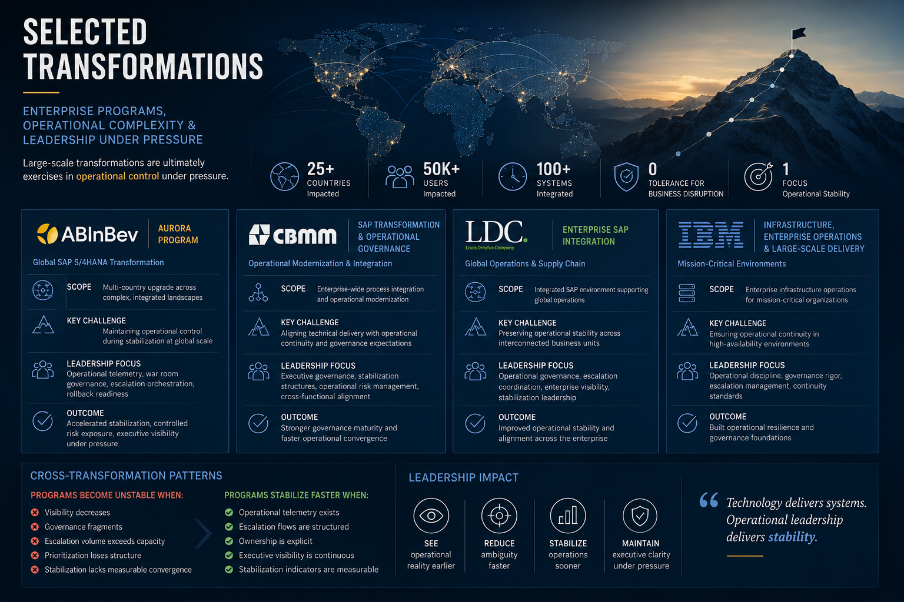

# Selected Transformations

  

  <em>
    Large-scale transformations are ultimately exercises in operational control under pressure.
  </em>

## Enterprise Programs, Operational Complexity & Leadership Under Pressure

---

# Transformation Leadership Is Primarily About Complexity Management

Enterprise transformations rarely fail because organizations lack technical capability.

That is worth saying clearly, because the post-mortem on most failed programs will focus on technology: integration issues, data quality problems, testing gaps, cutover incidents. Those are real. They are also symptoms, not causes.

The underlying cause is almost always the same: operational complexity exceeded governance capacity. Decision quality deteriorated under pressure. Stabilization lost structure at precisely the moment structure was most needed. Visibility collapsed across teams. Leadership discovered how bad things were too late to respond with low-cost interventions.

The programs described here were not operationally significant simply because of their scale. They were significant because they required operational orchestration, governance discipline, executive alignment, and stabilization leadership under sustained pressure. The technology was the context. The governance was the challenge.

This is not an exhaustive project history. It focuses on transformations where operational governance became a critical success factor, and on what those programs revealed about the gap between delivery execution and operational stability.

---

# AB InBev — Aurora Program

## Context

Aurora is AB InBev's global SAP S/4HANA transformation initiative, one of the largest and most complex SAP programs currently in execution across the industry. The scope involves multi-country operations, highly integrated landscapes, compressed delivery timelines, and business continuity expectations that leave limited room for operational instability after deployment.

The program does not have the luxury of gradual stabilization. The business runs continuously. The transformation has to absorb that reality.

## Operational Complexity

The operational environment combines multiple SAP landscapes, cross-functional dependencies spanning procurement, logistics, finance, and commercial operations, international coordination across regions with different regulatory requirements and operational calendars, and cutover windows that must be executed with surgical precision under executive visibility.

The technical upgrade constraints are significant. The integration surface is large. The tolerance for post go-live instability is low.

But the real complexity is not technical. It is organizational: maintaining operational control during stabilization while multiple teams, multiple vendors, and multiple workstreams operate simultaneously under sustained pressure. The system goes live. The program does not end. In many ways, the hardest part begins.

## Governance Challenge

The primary governance challenge is balance: deployment execution running in parallel with operational continuity, escalation management competing with stabilization convergence, executive visibility requirements consuming bandwidth that teams need for actual problem-solving.

As in most large-scale transformations, the operational risk profile increases significantly in the weeks immediately following go-live. Incidents surface that testing did not catch. Operational behavior differs from what the business expected. User confidence fluctuates. The organization is simultaneously running at lower-than-normal efficiency while being asked to operate a system it has never used in production.

Governance structures that were adequate for managing delivery become inadequate for managing that reality. Decision-making has to accelerate. Ambiguity has to be reduced. Operational impact has to drive prioritization rather than political weight or escalation volume.

## Leadership Focus

Work as Cutover and Transition Lead concentrated on operational telemetry, integrated war room governance, command center coordination, and stabilization management. Hypercare operational structure received particular attention because that is where most programs lose control without noticing.

Executive reporting was designed to reflect operational reality rather than curated optimism. Rollback readiness was maintained beyond the standard window because the risk profile justified it. Convergence monitoring tracked whether stabilization was actually progressing or merely appearing to progress because volume had temporarily decreased.

## Strategic Lessons

Large-scale SAP programs rarely fail because of the deployment itself. Cutover is visible, managed, and intensely scrutinized. It is the weeks after cutover, when governance starts to relax and teams are exhausted, that operational risk accumulates.

The experience reinforced several principles that apply across programs of this type: hypercare requires governance structure, not only support capacity; war rooms without telemetry deteriorate quickly under pressure; executive visibility reduces operational risk by improving decision quality; stabilization must be measurable to be manageable; operational convergence does not happen automatically after go-live. It has to be governed.

---

# CBMM — SAP Transformation & Operational Governance

## Context

CBMM, one of the world's leading niobium producers, operates critical industrial and commercial processes with a low tolerance for operational disruption. The SAP transformation involved modernizing and integrating core business processes across an environment where operational continuity was not a preference but a requirement.

## Operational Complexity

The transformation involved highly interconnected operational processes across functions that directly impact production and commercial delivery. Cross-functional dependencies were significant. The business was unwilling, correctly, to accept an extended stabilization period that would compromise operational performance.

Operational readiness was therefore not a phase at the end of the project. It was a governance concern throughout delivery.

## Governance Challenge

The governance challenge extended beyond project execution into operational territory that most traditional PMO structures are not designed to manage. Maintaining decision quality under increasing operational pressure, aligning technical priorities with business impact, managing escalations without allowing volume to overwhelm structure: these were the real tests of governance maturity.

The gap between what the project plan showed and what the operation was actually experiencing created friction that had to be managed actively. Left unmanaged, that gap produces exactly the kind of extended stabilization and operational fatigue that erodes executive confidence.

## Leadership Focus

Focus areas included executive governance, operational coordination, stabilization support structures, and integrated delivery oversight. Operational risk management required continuous calibration as the program progressed through go-live and into the stabilization period.

## Strategic Lessons

Operational governance maturity directly determines how fast an organization stabilizes after a large SAP deployment. Organizations with fragmented governance structures, where accountability is unclear and visibility is limited, experience slower convergence, prolonged hypercare, operational fatigue that compounds over weeks, and declining executive confidence that is difficult to recover once lost.

The inverse is also true. When governance is structured, escalation flows are clear, and stabilization is measured rather than estimated, organizations recover faster and with less collateral damage to the teams involved.

---

# Louis Dreyfus Company (LDC)

## Context

Louis Dreyfus Company operates one of the world's largest agricultural commodity trading and processing businesses, with international operations across multiple continents and supply chain dependencies that connect directly to global markets. The operational environment demands high reliability and governance precision. Instability after deployment is not an abstract risk. It has direct commercial consequences.

## Operational Complexity

The complexity drivers in this environment were substantial: operational dependency across business units, integrated process execution across trading, logistics, and finance, international coordination across regions with different operational rhythms, and a business model where delays and errors translate quickly into financial exposure.

## Governance Challenge

The primary leadership challenge was maintaining operational visibility across multiple simultaneous moving parts while preserving execution speed, governance discipline, and stabilization quality. Those objectives do not always pull in the same direction. Speed creates risk. Governance discipline can slow execution. Stabilization quality requires focus that compressed timelines make difficult to sustain.

Managing that tension under real operational pressure, with executive stakeholders tracking progress closely, required governance structures that could adapt without losing coherence.

## Leadership Focus

Leadership efforts concentrated on operational governance, cross-functional orchestration, escalation coordination, and executive visibility. Stabilization was treated as a governance discipline, not a support function.

## Strategic Lessons

Operational complexity grows exponentially when governance visibility decreases. The relationship is not linear. A small reduction in visibility produces a disproportionate increase in escalation noise, prioritization conflicts, and stabilization uncertainty.

The absence of structured operational telemetry does not simply make governance harder. It changes the nature of the problem: instead of managing a complex operation, leadership ends up managing the noise produced by a complex operation without adequate instrumentation.

---

# IBM — Infrastructure, Enterprise Operations & Large-Scale Delivery

## Context

Early career experience managing enterprise-scale infrastructure and operational environments across organizations where the cost of failure was not measured in project KPIs but in mission impact.

The environments included organizations such as the Pentagon, NASA, Boeing, the Bank of England, the Bank of Canada, Qantas Airlines, and Coca-Cola. Each operated under different constraints. All shared one requirement: the infrastructure had to work, continuously, without negotiation.

## Operational Complexity

Mission-critical infrastructure operations teach a specific kind of discipline that project management frameworks do not fully capture. The environment is unforgiving. Incidents are not deviation from plan; they are operational reality that has to be managed in real time, with incomplete information, under pressure that does not relent because the team is tired.

Governance in that context is not about documentation or status reporting. It is about maintaining operational control when control is hardest to maintain.

## Strategic Lessons

Many of the operational governance principles later applied to large SAP transformations were formed in infrastructure operations. Not because the technical domains are similar, but because the operational challenges are structurally identical.

Under pressure, visibility reduces instability. Structured escalation improves decision quality. Operational continuity depends on governance maturity, not on individual heroics. Reactive operations do not scale. Those lessons do not change when the technology changes.

The discipline transfers.

---

# Cross-Transformation Patterns

Across industries, organizations, and transformation models, the same operational patterns repeat with enough consistency to be treated as structural rather than situational.

Programs become operationally unstable when visibility decreases and nobody acts on that decrease early enough. When governance fragments across workstreams without a coordination layer. When escalation volume exceeds the capacity of the structure to process it with quality. When prioritization loses structure and defaults to whoever escalates loudest. When stabilization is declared based on perception rather than measured against defined indicators.

The inverse is equally consistent. Transformations stabilize faster when telemetry exists and leadership actually uses it. When escalation flows are structured and owned. When operational accountability is explicit rather than distributed across everyone and therefore owned by no one. When executive visibility is continuous rather than periodic. When stabilization indicators are defined before go-live and measured afterward.

These patterns became foundational to the governance frameworks and operational models developed across these programs. They are not theoretical constructs. They are observations extracted from operational reality, program by program, over more than three decades of enterprise IT.

---

# Final Perspective

Technology complexity is increasing. That trajectory will not reverse.

Operational tolerance for instability is decreasing. Business expectations for continuous availability, regulatory requirements, and competitive pressure all push in the same direction.

The gap between those two realities is where modern transformation leadership now operates. It is not a comfortable space. It demands governance models that most organizations have not yet fully developed, and leadership capabilities that delivery-focused PMO structures were not designed to produce.

The organizations that succeed in that environment will not necessarily be the ones with the largest programs, the biggest budgets, or the most comprehensive governance processes. They will be the ones capable of observing operational reality earlier than their peers, reducing ambiguity faster, stabilizing systems with less collateral damage, and maintaining executive clarity under the kind of sustained pressure that causes most governance structures to fragment.

Because in enterprise transformations, operational stability is ultimately what the business paid for.

Everything else is execution.