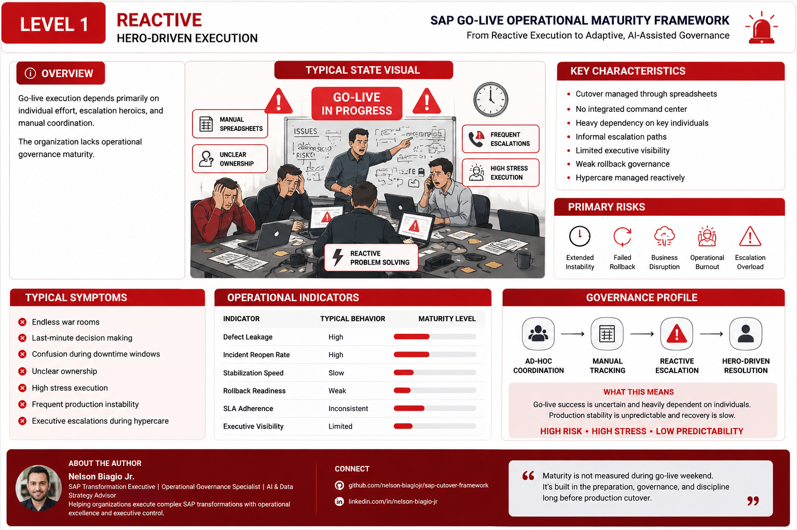

# SAP Go-Live Maturity Levels

# SAP Go-Live Maturity Levels

# SAP Go-Live Maturity Levels

  

A practical framework to evaluate how organizations execute SAP go-lives
across governance, cutover orchestration, hypercare, stabilization, andexecutive control.

---

## Why Most Go-Live Assessments Miss the Point

Organizations measure go-live success by technical completion.
System up. Data migrated. Users logged in. Deployment closed.

That is not success. That is the minimum viable outcome.

Mature organizations measure something harder to quantify:
- How fast did you stabilize?
- How well did you contain the inevitable incidents?
- How visible were you to the business during the chaos?
- Could you repeat this execution at twice the scale?

A technically completed deployment does not mean the organization
is capable of doing it again — under more pressure, across more
geographies, with higher business impact on the line.

That distinction is what this framework addresses.

---

## The 5 Levels of SAP Go-Live Maturity

| Level | Name | Primary Characteristic |
|---|---|---|
| 1 | Reactive | Hero-driven execution |
| 2 | Structured | Process-based coordination |
| 3 | Controlled | Integrated operational governance |
| 4 | Predictive | Metrics-driven risk anticipation |
| 5 | Adaptive | AI-assisted autonomous governance |

Most organizations believe they are at Level 3.
Most are operating at Level 2.

---

## Level 1 — Reactive

# Level 1 — Reactive

  

### What It Looks Like

Go-live execution depends on individuals, not systems.

There is always a person who knows where everything is,
who calls whom when something breaks, and who personally
holds the critical path together. That person does not sleep
during cutover weekend. They are indispensable — which is
precisely the problem.

Remove that person, and the execution collapses.

### Structural Characteristics

- Cutover managed through spreadsheets with no live orchestration
- No integrated command center or formal war room protocol
- Escalation paths informal and undocumented
- Rollback decisions made under pressure, without rehearsed criteria
- Hypercare reactive by design — response only after incidents appear
- Executive visibility limited to whatever the project manager
  can summarize on the fly

### Operational Indicators

| Indicator | Typical Behavior |
|---|---|
| Defect Leakage into Production | High |
| Incident Reopen Rate | High |
| Stabilization Timeline | Unpredictable |
| Rollback Readiness | Absent or informal |
| SLA Adherence | Inconsistent |
| Executive Visibility | Fragmented |

### What the Business Feels

Extended war rooms that nobody controls.
Executive escalations that arrive before the team has answers.
Production instability that lasts weeks instead of days.
Post-go-live reviews that produce reports, not change.

### Root Cause

This is not a people problem. It is a governance problem.
Organizations at Level 1 have not institutionalized execution.
They have institutionalized dependency on exceptional people
to compensate for the absence of process.

---

## Level 2 — Structured

### What It Looks Like

The organization recognizes the problem and responds with process.
Cutover plans are documented. Checkpoints are formal. Roles have names.

This is progress. It is also where many organizations stall.

### Structural Characteristics

- Formal cutover plan exists and is distributed before go-live
- Transport freeze governance implemented, though inconsistently enforced
- Structured checkpoint meetings with defined attendees
- Basic escalation framework defined on paper
- Hypercare ownership assigned, though coverage is incomplete
- Risk register maintained, though infrequently updated

### What Improved Over Level 1

- Coordination is better
- Accountability is clearer
- Downtime execution is more predictable
- Communication chaos is reduced

### What Did Not Improve

The organization added structure without integration.
Each workstream coordinates internally.
Cross-stream dependency management remains informal.
Incident reporting depends on people choosing to report.
Executive dashboards exist but are built manually from status emails.

When something goes wrong in production, the team responds well
within their own lane. Cross-lane problems still create confusion.

### Operational Indicators

| Indicator | Typical Behavior |
|---|---|
| Defect Leakage into Production | Moderate |
| Incident Reopen Rate | Moderate |
| Stabilization Timeline | Improving but inconsistent |
| Rollback Readiness | Partial |
| SLA Adherence | Partially controlled |
| Executive Visibility | Periodic reporting |

---

## Level 3 — Controlled

### What It Looks Like

Execution becomes genuinely integrated.

A command center exists and functions. Rehearsals are
not optional. Escalation paths are tested before go-live,
not discovered during it. The organization has moved from
coordinating work to governing operations.

### Structural Characteristics

- Multiple cutover rehearsal cycles completed before go-live
- Integrated command center with defined roles, protocols,
  and communication rhythms
- Cross-stream dependency map maintained and actively managed
- Formal hypercare governance: coverage windows, escalation
  criteria, resolution SLAs
- Rollback decision criteria defined in advance, not under pressure
- Executive reporting cadence established and maintained
  throughout cutover and stabilization

### Core Operational Capabilities

At this level, the organization can do three things it could not
reliably do before:

**Triage faster.** Incidents are categorized, owned, and resolved
within structured timeframes. The question is no longer
"who handles this?" but "how fast can we close it?"

**Absorb surprises.** When unexpected issues arise — and they always
do — the governance structure contains them without requiring
escalation to the executive level for every operational decision.

**Report accurately.** Executive visibility is no longer dependent
on someone summarizing a war room. The command center produces
real information, not managed messaging.

### Operational Indicators

| Indicator | Typical Behavior |
|---|---|
| Defect Leakage into Production | Controlled |
| Incident Reopen Rate | Reduced |
| Stabilization Timeline | Predictable |
| Rollback Readiness | Formally structured |
| SLA Adherence | Stable |
| Executive Visibility | High |

### The Critical Transition

Level 3 is where organizations stop executing projects
and start building an operational capability.

The difference matters. A project ends. A capability scales.

---

## Level 4 — Predictive

### What It Looks Like

Governance becomes proactive rather than responsive.

The organization does not wait to see if something breaks.
It monitors leading indicators, scores readiness against
historical patterns, and intervenes before incidents materialize.

### Structural Characteristics

- KPI-driven governance with defined thresholds for escalation
- Readiness scoring models applied during hypercare and stabilization
- Defect trend analysis used to forecast production stability
- SLA breach prediction integrated into command center operations
- Risk quantification built into cutover planning, not added at the end
- Operational telemetry dashboards available in real time
  to both execution teams and executive stakeholders

### What This Requires

Data discipline over multiple go-live cycles.

Organizations cannot build predictive capability from a single
deployment. It requires deliberate capture of operational data
across projects, structured retrospective analysis, and investment
in tools that aggregate and interpret that data.

Organizations that arrive at Level 4 did not accidentally
become predictive. They chose to build that capability
when it was inconvenient to do so.

### Typical Tooling

- SAP Cloud ALM for operational monitoring
- SAP Focused Run for system performance telemetry
- Azure DevOps or equivalent for test and defect analytics
- Power BI for executive dashboards with live data integration
- Custom readiness scoring models built from project history

### Operational Indicators

| Indicator | Typical Behavior |
|---|---|
| Defect Leakage into Production | Low |
| Incident Reopen Rate | Low |
| Stabilization Timeline | Fast |
| Rollback Readiness | Mature and rehearsed |
| SLA Adherence | Highly controlled |
| Executive Visibility | Real-time |

---

## Level 5 — Adaptive

### What It Looks Like

The distinction between execution and governance disappears.

AI-assisted orchestration monitors operations continuously,
surfaces anomalies before they escalate, routes decisions
to the right owners dynamically, and adjusts hypercare
coverage in response to actual production behavior,
not predetermined schedules.

This is not a theoretical state. The building blocks exist today.
The organizations getting there are the ones that invested
seriously in Levels 3 and 4 first.

### Structural Characteristics

- AI-assisted command center operations with automated anomaly detection
- Dynamic dependency validation during cutover execution
- Real-time operational telemetry with predictive intervention triggers
- Intelligent escalation routing based on incident pattern recognition
- Automated risk prioritization during stabilization
- Self-adjusting hypercare coverage based on live production stability metrics

### What Level 5 Is Not

It is not the absence of human judgment.

AI-assisted governance accelerates operational decisions
and reduces the cognitive load on execution teams.
It does not replace the accountability of the cutover lead,
the judgment of the program manager, or the experience
of the people who have seen deployments fail in ways
that no model has been trained to recognize.

### Operational Indicators

| Indicator | Typical Behavior |
|---|---|
| Defect Leakage into Production | Minimal |
| Incident Reopen Rate | Minimal |
| Stabilization Timeline | Accelerated |
| Rollback Readiness | Fully governed |
| SLA Adherence | Predictive |
| Executive Visibility | Continuous |

---

## The Transition Map

Level 1 — Reactive
↓  Governance discipline
Level 2 — Structured
↓  Operational integration
Level 3 — Controlled
↓  Metrics maturity
Level 4 — Predictive
↓  AI-assisted governance
Level 5 — Adaptive

Each transition requires different work.

The move from 1 to 2 is about installing process.
The move from 2 to 3 is about integrating it.
The move from 3 to 4 is about measuring what matters.
The move from 4 to 5 is about automating what is measurable.

Organizations that try to skip levels do not accelerate.
They build structured facades over reactive cores.

---

## Where Most Organizations Actually Are

After 18 years managing SAP go-lives across sectors,
geographies, and program complexities, the distribution
I observe consistently:

- **Level 1:** More common than anyone admits
- **Level 2:** Where most organizations plateau
- **Level 3:** Where serious transformation programs operate
- **Level 4:** Rare. Found in organizations with multiple
  large-scale deployments and deliberate investment in
  operational data
- **Level 5:** Emerging. Not yet widespread.

The gap between self-assessed maturity and actual operational
maturity is the most consistent finding across programs.

---

## What Mature Go-Live Capability Produces

Organizations with Level 3 and above execution capabilities:

- Stabilize production faster and with less business disruption
- Absorb operational surprises without executive escalation cascades
- Reduce hypercare duration and support costs
- Scale transformation programs without proportional increase in risk
- Improve business adoption because the go-live experience
  does not permanently damage user confidence
- Make better rollback decisions because the criteria
  were defined before the pressure arrived

These are not soft outcomes. They are measurable.
They appear in stabilization timelines, incident volumes,
support costs, and business continuity metrics.

---

## Final Observation

Most SAP go-live failures do not begin on deployment weekend.

They begin months earlier, when the organization
makes a quiet decision: to treat cutover as an event
rather than an operational capability.

That decision shapes everything that follows.

The weekend is just when it becomes visible.