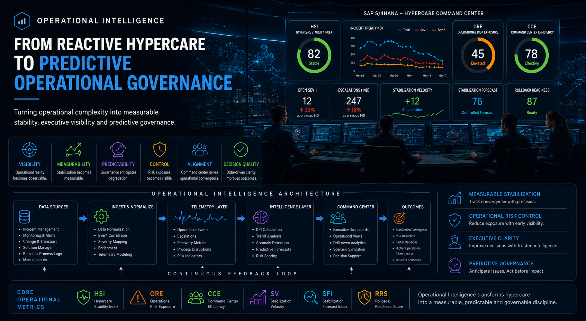

# Operational Intelligence

<p align="center">
  
</p>

<p align="center">
  <em>
    Turning operational complexity into measurable stability, executive visibility and predictive governance.
  </em>
</p>operational-intelligence-hero.png

## From Reactive Hypercare to Predictive Operational Governance

---

# Most SAP Programs Lack Operational Visibility

Large-scale SAP transformations rarely fail during deployment.

They fail during stabilization.

That distinction is not semantic. Deployment is visible, intensely managed, and surrounded by governance structures that have been refined over decades of SAP program execution. Cutover plans, go/no-go criteria, rollback procedures, hypercare team activation: the industry knows how to manage the moment of go-live reasonably well.

What happens in the weeks after go-live is a different problem. Escalation volume increases as users encounter operational realities that testing did not fully anticipate. Complexity expands as cross-functional dependencies surface under real production load. Teams are exhausted. Governance structures designed for delivery start to show their limits in an operational context they were not built for.

Most organizations respond to that situation with the tools they already have: fragmented escalations, static status reports, manual coordination, anecdotal operational assessment, and reactive decision-making. Those tools were adequate for simpler programs in simpler times. They do not scale effectively for multi-country SAP deployments, highly integrated landscapes, compressed cutover windows, or operations where the business tolerance for instability after go-live is measured in days, not weeks.

Operational Intelligence was designed to address that gap directly.

---

# Why Operational Intelligence Matters

The problem is structural, not situational.

Modern SAP landscapes became more integrated, more global, more operationally sensitive, and more dependent on real-time process execution. A disruption in one part of the landscape propagates faster and further than it would have a decade ago. The cost of operational instability after go-live increased.

At the same time, governance models remained largely milestone-driven, delivery-centric, and escalation-oriented. They were optimized for the question that matters during execution: is the project on track? They were not optimized for the question that matters after go-live: is the operation actually stabilizing?

The result is a gap that is now visible across enterprise transformations of every type and size.

Operational complexity exceeded governance visibility. Not occasionally, not in poorly managed programs, but structurally, as a predictable consequence of the mismatch between how governance was designed and what it is now asked to manage.

That gap produces a consistent set of consequences: stabilization instability that extends well beyond initial forecasts, escalation overload that consumes governance capacity and degrades decision quality, hidden operational risk that leadership discovers too late to respond to effectively, and prolonged hypercare cycles that drain team energy and erode business confidence.

Operational Intelligence attempts to transform operational stabilization from an art form dependent on individual expertise and institutional memory into an observable, measurable, telemetry-driven governance discipline.

---

# Strategic Objective

The objective is not dashboards.

That is worth stating clearly because the instinct, when faced with a visibility problem, is to build more reporting. More dashboards. More status slides. More metrics that produce more data that gets reviewed in more meetings without improving the quality of decisions made in those meetings.

That is not what this is.

The objective is measurable stabilization: the ability to know, with confidence, whether the operation is converging or degrading, and how fast. Operational observability that surfaces the signal leadership needs before the situation becomes a crisis. Executive clarity that is grounded in operational reality rather than curated perception. Predictive governance that allows leadership to anticipate problems rather than react to them.

And convergence intelligence: the ability to answer the question that every executive sponsor needs answered during hypercare, and that most programs cannot answer with precision until it is too late to act on.

All of that under sustained operational pressure, when the organization is tired, the business is impatient, and the margin for error is narrow.

---

# Capability Architecture

The capability is organized around four operational layers, each serving a distinct governance function.

| Layer | Purpose |
|---|---|
| Telemetry Layer | Collect operational signals and stabilization metrics |
| Intelligence Layer | Generate convergence and risk visibility |
| Governance Layer | Support operational orchestration and escalation control |
| Executive Layer | Improve decision quality and operational clarity |

The layered architecture matters because it separates collection from interpretation, and interpretation from governance action. Raw operational data without analytical structure produces noise. Analytical structure without governance integration produces insight that nobody acts on. The architecture is designed to close both gaps.

---

# Core Operational Domains

Six operational domains define the scope of what the capability measures and governs.

| Domain | Objective |
|---|---|
| Stabilization | Measure convergence after go-live |
| Governance | Evaluate operational coordination quality |
| Operational Risk | Quantify residual operational exposure |
| Recovery Readiness | Assess rollback and recovery capability |
| Predictive Intelligence | Anticipate stabilization degradation |
| Executive Visibility | Improve operational decision quality |

Each domain addresses a specific governance blind spot that traditional delivery reporting leaves uncovered. Together they provide a complete operational picture: where the program is, how fast it is improving, how much risk remains, whether the governance structure itself is functioning effectively, and what the trajectory suggests about the next thirty days.

---

# Core Operational Metrics

Six KPIs form the telemetry backbone of the capability.

| KPI | Description |
|---|---|
| HSI | Hypercare Stability Index |
| ORE | Operational Risk Exposure |
| CCE | Command Center Efficiency |
| SV | Stabilization Velocity |
| SFI | Stabilization Forecast Index |
| RRS | Rollback Readiness Score |

These metrics are defined in full in the Metrics Dictionary, including formulas, weighting logic, interpretation thresholds, deterioration signals, and recommended leadership actions. The summary here is intentional: metrics without context produce the same governance problems as no metrics at all.

---

# Repository Components

## Metrics Dictionary

Defines KPI semantics, formulas, scoring thresholds, operational interpretation, and the leadership actions each metric is designed to trigger. The starting point for anyone implementing or evaluating the telemetry model.

→ [Open Metrics Dictionary](./metrics-dictionary.md)

## Operational KPIs

Provides executive-level interpretation of stabilization indicators, convergence metrics, and operational telemetry models. Designed for leadership consumption without requiring deep familiarity with the underlying methodology.

→ [Open Operational KPIs](./operational-kpis.md)

## Telemetry Model

Explains the architecture used to measure stabilization, improve governance visibility, evaluate operational maturity, and support executive command centers. Covers both the conceptual model and its practical implementation.

→ [Open Telemetry Model](./telemetry-model.md)

## Datasets

Synthetic operational datasets designed to simulate hypercare environments, escalation patterns, stabilization behavior, and SAP transformation telemetry. Built for model development, testing, and demonstration without requiring access to live program data.

```text
/datasets
```

## Models

Operational telemetry models and Power BI prototypes for executive dashboard development and stabilization analytics.

```text
/models
```

## Screenshots

Executive dashboard examples and operational telemetry visualizations showing the capability in applied context.

```text
/screenshots
```

---

# Operational Philosophy

The philosophy behind this capability can be stated simply: governance that cannot observe operational reality cannot manage it.

That is not a criticism of the people operating traditional governance models. It is a structural observation about what those models were designed to do. They were designed to manage delivery. They were not designed to govern operations.

Operational governance becomes substantially more effective when stabilization is measurable rather than estimated, when operational risk is visible rather than assumed, when convergence is observable rather than felt, when telemetry supports decisions rather than anecdote, and when degradation is detected early enough for low-cost intervention rather than discovered late enough to require crisis management.

Large-scale SAP transformations do not fail because organizations lack effort or competence. They fail when operational complexity exceeds governance visibility. The gap between those two things is what this capability is built to close.

---

# Executive Command Center Vision

The long-term objective is a SAP Operational Intelligence Platform capable of supporting hypercare command centers with predictive operational analytics, real-time stabilization governance, and AI-assisted decision support integrated directly into the operational workflow.

That is not a distant aspiration. The foundational components are already operational: the telemetry model, the KPI framework, the governance architecture, the executive visibility layer. What evolves is the degree of automation, the predictive capability, and the integration depth.

The command center of the next generation will function less like a meeting and more like a control tower. Leadership will not gather to discuss what happened yesterday. They will monitor what is happening now, observe where the trajectory is pointing, and make decisions informed by operational intelligence rather than escalation volume.

That shift requires investment in instrumentation before it requires investment in process. The process follows naturally once the instrumentation exists.

---

# Capability Evolution

The roadmap follows a deliberate progression from reactive to predictive.

The starting point is reactive hypercare coordination: the model most organizations currently operate, where governance responds to what escalates and hopes that response is fast enough to prevent compounding damage.

The intermediate state is structured operational governance: telemetry-driven, with measurable stabilization indicators, clear convergence targets, and command center structures capable of making decisions rather than merely discussing situations.

The target state is predictive operational governance: where the capability anticipates degradation before it manifests visibly, where stabilization forecasting replaces stabilization guessing, and where executive decisions are made with the same quality of information in week three of hypercare as they were in the controlled environment of cutover planning.

Future releases will expand executive command center intelligence, predictive telemetry models, operational convergence analytics, stabilization forecasting, and AI-assisted governance support. Each release closes the gap between where most organizations currently operate and where operational complexity now requires them to be.

---

# Final Observation

Traditional SAP governance asks: is the project on track?

Operational Intelligence asks: is the operation actually stabilizing?

Those are different questions. They require different instruments, different governance structures, and different leadership behaviors.

Modern enterprise transformations are no longer constrained primarily by delivery complexity. Most organizations have developed sufficient capability to plan and execute large SAP programs with reasonable predictability. The constraint that remains, and that causes the most visible operational damage, is what happens after deployment.

That constraint will not be solved by better project management. It will not be solved by more meetings, more status reports, or more governance layers.

It will be solved by operational intelligence: the ability to observe what is actually happening, measure whether it is improving, anticipate where it is heading, and make decisions grounded in evidence rather than pressure.

That is what this capability is built to deliver.