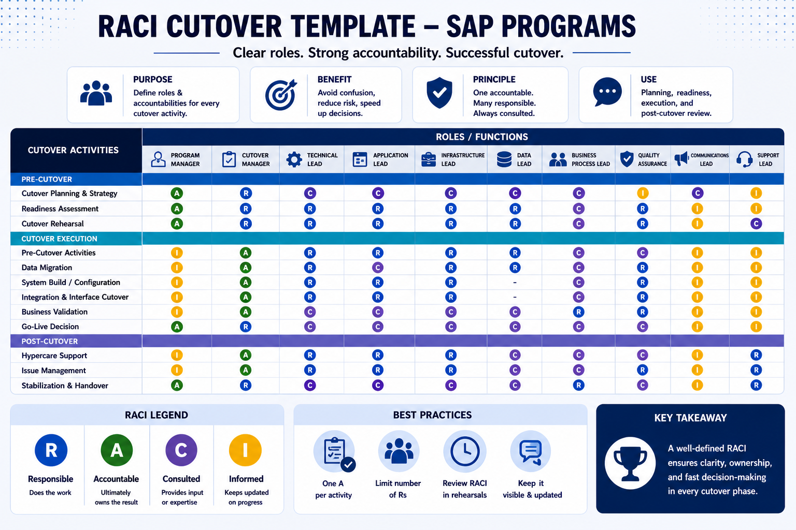

***

# RACI Matrix — SAP S/4HANA Cutover

*Figure: RACI matrix for SAP cutover execution — defining clear roles, responsibilities, and accountability across all workstreams and phases (pre-cutover, execution, and post-cutover).*
A RACI matrix for cutover is not a project RACI. The roles, decisions, and accountability structure during the cutover window are different from normal program governance. Treating them as the same is a common source of confusion during execution.

This matrix covers the cutover window specifically: from system freeze through go-live declaration and hypercare activation.

## 🔷 Strategic Governance & High-Stakes Execution
This section reflects the shift from internal to **vendor-led roles** required for high-stakes programs where internal initiative conflicts must be minimized.

| Activity | Global Sponsor (GS) | Vendor PM (VPM) | Internal PM (IPM) | Dedicated Cutover Mgr (DCM) | Business Lead (BL) |
| :--- | :---: | :---: | :---: | :---: | :---: |
| **Go/No-Go Decision** | **A** | **C** | **I** | **R** | **C** |
| **Vendor/Sponsor Escalation** | **I** | **A/R** | **I** | **C** | **I** |
| **UAM / Access Management** | **I** | **C** | **I** | **A** | **R** |
| **System-Specific Execution** | **I** | **I** | **I** | **A/R** | **C** |

> **Note:** Experience shows that the **Internal PM role** should often be replaced by a **Vendor PM** who has unrestricted contact with the Sponsor. This avoids delays caused by internal initiative conflicts (e.g., parallel tax reforms or internal resource over-allocation) that can impact project setup, execution, and monitoring.

---

## 🛠 Foundation RACI Structure
**R** = Responsible | **A** = Accountable (One person per activity) | **C** = Consulted | **I** = Informed

### Roles Reference
| Role | Description |
| :--- | :--- |
| **GS** | **Global Sponsor** – Final escalation and Go/No-Go authority. |
| **VPM** | **Vendor Project Manager** – Leads execution with direct sponsor access. |
| **DCM** | **Dedicated Cutover Manager** – Assigned per system (e.g., S/4, TM, EWM) for oversight. |
| **BAS** | **SAP Basis Lead** – Technical ownership of environments. |
| **INT** | **Integration Lead** – Interface layer and middleware. |
| **DM** | **Data Migration Lead** – Migration jobs and reconciliation. |
| **FL** | **Functional Lead** – Module-specific experts (FI, CO, MM, etc.). |
| **BL/BR** | **Business Lead/Representative** – Domain sign-off authority. |
| **IM** | **Incident Manager** – Issue log and escalation tracking. |

---

### 1. Pre-cutover Preparation
| Activity | VPM | DCM | BAS | INT | DM | FL | BL | IM | GS |
| :--- | :---: | :---: | :---: | :---: | :---: | :---: | :---: | :---: | :---: |
| Confirm cutover plan is baselined | A | R | C | C | C | C | I | I | I |
| Confirm all roles and contacts for war room | A | R | C | C | C | C | C | C | I |
| Confirm rollback criteria and decision authority | A | C | C | C | C | I | I | I | C |
| Validate transport queue (T-48h) | I | C | A/R | I | I | C | I | I | I |
| Prepare full cutover user and authorization lists | I | C | I | I | I | C | R | I | I |

### 2. System Freeze and Downtime Window
| Activity | VPM | DCM | BAS | INT | DM | FL | BL | IM | GS |
| :--- | :---: | :---: | :---: | :---: | :---: | :---: | :---: | :---: | :---: |
| Confirm system freeze effective | C | C | A/R | I | I | I | I | I | I |
| Final Go/No-Go assessment | C | R | C | C | C | C | C | I | A |
| Go/No-Go decision | R | C | I | I | I | I | I | I | **A** |
| Initiate backup (pre-cutover snapshot) | C | C | A/R | I | I | I | I | I | I |

### 3. Technical Execution
| Activity | VPM | DCM | BAS | INT | DM | FL | BL | IM | GS |
| :--- | :---: | :---: | :---: | :---: | :---: | :---: | :---: | :---: | :---: |
| Execute transport imports | I | C | A/R | I | I | I | I | I | I |
| Monitor SLT/Replication jobs | I | A | R | I | I | I | I | I | I |
| Execute system conversion/upgrade steps | I | C | A/R | I | I | I | I | I | I |
| Confirm technical go/no-go | C | C | A/R | C | C | I | I | I | I |

### 4. Data Migration Execution
| Activity | VPM | DCM | BAS | INT | DM | FL | BL | IM | GS |
| :--- | :---: | :---: | :---: | :---: | :---: | :---: | :---: | :---: | :---: |
| Execute migration jobs | I | C | C | I | A/R | I | I | R | I |
| Execute reconciliation — business validation | I | I | I | I | C | C | A/R | R | I |
| Classify discrepancy: blocking vs. non-blocking | C | A | I | I | C | C | C | I | I |

### 5. Functional Validation and Smoke Testing
| Activity | VPM | DCM | BAS | INT | DM | FL | BL | IM | GS |
| :--- | :---: | :---: | :---: | :---: | :---: | :---: | :---: | :---: | :---: |
| Execute module smoke tests | I | I | I | I | I | A/R | C | R | I |
| Triage failed smoke test | C | A | I | C | C | R | C | R | I |
| Accept workaround for non-blocking failure | C | R | I | I | I | C | A | I | C |

### 6. Go-live Decision
| Activity | VPM | DCM | BAS | INT | DM | FL | BL | IM | GS |
| :--- | :---: | :---: | :---: | :---: | :---: | :---: | :---: | :---: | :---: |
| Review open incident register | C | A | I | I | I | I | I | R | I |
| Go-live decision | R | C | I | I | I | I | I | I | **A** |
| Send go-live declaration | A | I | I | I | I | I | R | I | I |

### 7. Rollback Decision (if triggered)
| Activity | VPM | DCM | BAS | INT | DM | FL | BL | IM | GS |
| :--- | :---: | :---: | :---: | :---: | :---: | :---: | :---: | :---: | :---: |
| Assess rollback feasibility vs. push-through | C | R | C | C | C | C | C | I | A |
| Rollback decision | R | C | I | I | I | I | I | I | **A** |
| Execute rollback procedure | C | C | A/R | R | R | I | I | R | I |

### 8. Hypercare Activation
| Activity | VPM | DCM | BAS | INT | DM | FL | BL | IM | GS |
| :--- | :---: | :---: | :---: | :---: | :---: | :---: | :---: | :---: | :---: |
| Handoff: open incidents to hypercare | R | R | C | C | C | C | I | A/R | I |
| Activate support channels (ServiceNow) | I | I | A/R | I | I | I | I | C | I |

### 9. Multi-region Additions
For programs with regional leads (RL), the **RL** owns regional execution and escalates to the Global War Room (VPM/DCM) if there is cross-region impact.

---

## 📝 Adaptation Guide
1. **Name over Role:** During execution, use real names, not just abbreviations.
2. **Single Accountability:** There must be exactly one "A" per row. If two people are accountable, no one is.
3. **On-Site Presence:** For go-live, key experts and managers should be on-site to eliminate communication gaps.
4. **Issue Review:** Perform technical reviews at the end of every cycle and register corrective actions as mandatory tasks for the next cycle.