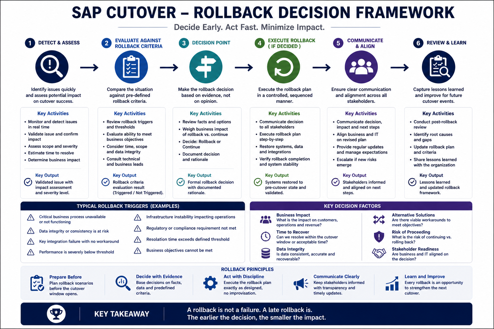

# SAP Cutover Rollback Framework: Operational Resilience & Governance

In high-criticality SAP S/4HANA programs, the rollback decision is 
not merely a technical procedure; it is a critical governance 
milestone that must be managed as a separate operation with its 
own command structure. This framework moves beyond simple 
task lists to provide an architectural view of cutover resilience 
based on real-world war room experience.

---

### 1. Strategic Governance & Decision Latency
The primary risk in global programs is decision latency—the time lost 
when authority is unclear or escalation paths are fragmented.

* **The "Single A" Principle:** The cutover RACI requires exactly 
one Accountable (A) person for the rollback decision—typically the 
Cutover Lead (CL). Committee-based decisions under 
pressure often result in "forced go-lives" because authority was 
too diluted to act.
* **Escalation Path Integrity:** All escalations must flow through 
a single channel. Parallel tracks, such as functional leads 
escalating independently to their own sponsors, consume critical 
downtime and push the program toward failure.
* **Vendor-led Leadership:** For high-stakes execution, the Project 
and Cutover Manager roles should be filled by a third-party vendor 
with unrestricted contact with the sponsor to ensure unbiased 
monitoring.

---

### 2. The Point of No Return (PoNR)
The Point of No Return (PoNR) is the formal boundary of technical 
and operational irreversibility.

* **Definition:** The PoNR is the latest possible timestamp in the 
schedule where restoration remains technically viable before data 
integration or technical conversion reaches a state where a rollback 
is no longer feasible.
* **The Paradox:** Crossing the PoNR without rigorous validation means 
the program has accepted a "forced go-live". At this stage, 
the cost of restoration exceeds the operational cost of pushing 
through with a compromised system.

---

### 3. High-Complexity Rollback Triggers
Triggers are pre-defined conditions that, when met, indicate the 
cutover plan is no longer viable.

#### A. Technical Debt & Tool Failures
* **SUM & Add-on Corruption:** Failure of the Software Update Manager 
(SUM) due to unresolved third-party Add-on incompatibilities.
* **Definition of Done (DoD) Breaches:** When technical tasks are 
completed with "free interpretation" or poor documentation, leading 
to divergent system states.
* **SLT Reprocessing:** Unexpected data in SLT controller tables 
impacting the correct return of replication operations.

#### B. Minimum Viable Compliance (MVC) & Fiscal Integrity
* **Tax Determination Failure:** In complex environments like Brazil, 
if post-conversion validation reveals corrupted tax determinations 
(TAXBRA) that cannot be fixed via the Firefighter mechanism, a 
rollback is mandatory.
* **Evidence Protocol Breach:** Failure to produce mandatory 
screenshots of critical fiscal tables (VK11) before and after 
execution, rendering the system unauditable.

#### C. Buffer Architecture & Planning
* **Phase-Based Buffer Depletion:** Utilizing phase-based buffers 
allows the Cutover Lead to see if a delay in early tasks will 
irrecoverably collapse the final validation window.
* **T-48h Validation Breach:** Discovering transport inconsistencies 
during the downtime that should have been caught during the 
mandatory T-48h validation.

---

### 4. Multi-Region & Multi-System Failures
Global programs face unique failure patterns that can trigger 
a rollback across an entire "wave".

* **The "Invisible Incident":** When regional teams solve problems 
locally without logging them in the central War Room. This 
lack of visibility prevents the central team from understanding 
downstream effects on shared integrations.
* **Premature Go-Live Declarations:** Declaring success before all 
regions in the wave have confirmed readiness. If a region 
reports a blocking issue after a public declaration, rolling 
back becomes a complex reputational decision.
* **Timezone Handoff Gaps:** Failure to conduct a structured 
briefing during shift changes (follow-the-sun), leading to teams 
reconstructing context instead of resolving incidents.

---

### 5. The Decision Mechanism: Assessment Protocol
Once a trigger is hit, the Cutover Lead facilitates an assessment 
across three main pillars:

1. **Technical Viability:** Can Basis restore from snapshots 
within the remaining window?
2. **Business Impact:** Is the cost of extended downtime higher 
than the cost of operating on the legacy system?
3. **Team Resilience:** Has resource exhaustion compromised the 
team's ability to execute a safe push-through?

---

### 6. Execution & Restoration Sequence
1. **Halt & Preserve:** Stop all active migration jobs immediately.
2. **Executive Trigger:** Formal notification to the SteerCo using 
pre-agreed communication templates.
3. **Basis Restoration:** The Basis Lead (BAS) initiates the 
point-in-time recovery.
4. **Verification:** Conduct a "Reverse Smoke Test" to ensure the 
legacy environment is stable.
5. **Post-Mortem:** Initiate a Root Cause Analysis (RCA) before 
proposing a revised timeline.

---

### 7. Summary of Roles (RACI Extract)
| Activity | Cutover Lead (CL) | Basis Lead (BAS) | SteerCo (SC) |
| :--- | :---: | :---: | :---: |
| Identify Rollback Trigger | R | C | I |
| Assess Feasibility | A | C | C |
| **Rollback Decision** | **A** | I | C |
| Execute Procedure | C | A/R | I |

*Key: A=Accountable, R=Responsible, C=Consulted, I=Informed.*

---

### 8. Mental Map

